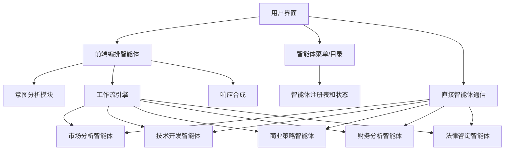

# 多智能体集成设计文档

## 概述

本文档概述了多智能体系统与前端集成的设计方案，为用户提供对专业AI智能体的透明访问和无缝编排交互。该系统通过前端编排智能体在用户控制和智能自动化之间取得平衡。

## 架构设计

### 系统组件



### 智能体分类

1. **市场分析智能体**
   - 市场研究和验证
   - 竞争对手分析
   - 客户细分
   - 趋势分析

2. **技术开发智能体**
   - 技术栈推荐
   - 架构设计
   - 开发规划
   - 技术风险评估

3. **商业策略智能体**
   - 商业模式设计
   - 战略规划
   - 增长策略
   - 合作伙伴推荐

4. **财务分析智能体**
   - 财务建模
   - 投资分析
   - 融资策略
   - 成本优化

5. **法律咨询智能体**
   - 法规合规
   - 知识产权指导
   - 合同分析
   - 法律风险评估

## 组件和接口

### 1. 前端编排智能体

**目的**: 作为用户和专业智能体之间的主要接口，处理意图分析和工作流协调。

**核心功能**:
- 用于意图分析的自然语言理解
- 多智能体工作流编排
- 响应合成和展示
- 跨智能体交互的上下文管理
- 错误处理和回退策略

**Interface**:
```typescript
interface OrchestratorAgent {
  analyzeIntent(userMessage: string, context: ProjectContext): Promise<IntentAnalysis>
  orchestrateWorkflow(intent: IntentAnalysis): Promise<WorkflowExecution>
  synthesizeResponse(agentResults: AgentResult[]): Promise<SynthesizedResponse>
  handleFallback(error: AgentError): Promise<FallbackResponse>
}

interface IntentAnalysis {
  primaryIntent: string
  requiredAgents: AgentType[]
  confidence: number
  parameters: Record<string, any>
  clarificationNeeded: boolean
}
```

### 2. 智能体菜单/目录组件

**目的**: 为用户提供可用智能体及其能力的可见性。

**功能特性**:
- 分类智能体列表
- 实时智能体状态（可用/忙碌/离线）
- 能力描述和示例
- 使用统计和推荐
- 快速访问直接通信

**Interface**:
```typescript
interface AgentCatalog {
  agents: AgentInfo[]
  categories: AgentCategory[]
  getAgentsByCategory(category: string): AgentInfo[]
  getAgentStatus(agentId: string): AgentStatus
  getRecommendations(context: ProjectContext): AgentInfo[]
}

interface AgentInfo {
  id: string
  name: string
  category: AgentCategory
  description: string
  capabilities: string[]
  status: AgentStatus
  averageResponseTime: number
  successRate: number
}
```

### 3. 工作流可视化组件

**目的**: 实时向用户展示多智能体工作流，建立透明度和信任。

**功能特性**:
- 可视化工作流表示
- 实时进度指示器
- 智能体交互时间线
- 错误和重试可视化
- 可展开的详细视图

**Interface**:
```typescript
interface WorkflowVisualization {
  workflow: WorkflowStep[]
  currentStep: number
  overallProgress: number
  showDetailedView: boolean
  agentInteractions: AgentInteraction[]
}

interface WorkflowStep {
  id: string
  agentId: string
  status: 'pending' | 'in-progress' | 'completed' | 'failed'
  startTime: Date
  endTime?: Date
  input: any
  output?: any
  error?: string
}
```

### 4. 直接通信模式

**目的**: 当用户明确知道自己需要什么时，允许用户直接与特定智能体通信。

**功能特性**:
- 智能体专用聊天界面
- 智能体间上下文切换
- 每个智能体的对话历史
- 快速返回编排模式

## 数据模型

### 用户交互模型

```typescript
interface UserMessage {
  id: string
  content: string
  timestamp: Date
  projectId?: string
  mode: 'orchestrated' | 'direct'
  targetAgentId?: string
}

interface AgentResponse {
  id: string
  agentId: string
  content: string
  timestamp: Date
  confidence: number
  sources?: string[]
  followUpSuggestions?: string[]
}

interface ConversationContext {
  projectId: string
  conversationHistory: (UserMessage | AgentResponse)[]
  activeAgents: string[]
  userPreferences: UserPreferences
}
```

### 智能体管理模型

```typescript
interface AgentRegistry {
  agents: Map<string, AgentInfo>
  categories: AgentCategory[]
  workflows: WorkflowTemplate[]
  userPreferences: Map<string, UserPreferences>
}

interface WorkflowTemplate {
  id: string
  name: string
  description: string
  steps: WorkflowStepTemplate[]
  triggers: string[]
}

interface UserPreferences {
  preferredAgents: string[]
  agentPriorities: Record<string, number>
  workflowPreferences: Record<string, any>
  notificationSettings: NotificationSettings
}
```

## 错误处理

### 智能体故障场景

1. **智能体不可用**: 编排器建议替代智能体或将请求加入队列
2. **智能体超时**: 使用指数退避自动重试
3. **无效响应**: 回退到更简单的智能体或人工升级
4. **工作流中断**: 保存状态并允许用户恢复或重新开始

### 错误恢复策略

```typescript
interface ErrorHandler {
  handleAgentFailure(agentId: string, error: AgentError): Promise<RecoveryAction>
  handleWorkflowFailure(workflowId: string, error: WorkflowError): Promise<RecoveryAction>
  handleTimeoutError(agentId: string): Promise<RecoveryAction>
}

type RecoveryAction = 
  | { type: 'retry', delay: number }
  | { type: 'fallback', alternativeAgent: string }
  | { type: 'escalate', reason: string }
  | { type: 'queue', estimatedWait: number }
```

## 测试策略

### 单元测试
- 单个智能体响应验证
- 意图分析准确性测试
- 工作流编排逻辑测试
- 错误处理场景测试

### 集成测试
- 多智能体工作流端到端测试
- 实时状态更新测试
- 智能体切换时的上下文保持
- 负载下的性能测试

### 用户体验测试
- 智能体菜单导航的可用性测试
- 工作流可视化清晰度测试
- 响应时间和用户满意度指标
- 编排模式与直接模式偏好的A/B测试

## 实施阶段

### 第一阶段：基础设施
- 智能体注册表和目录实现
- 具有简单意图分析的基础编排智能体
- 单个智能体的直接通信模式
- 基础工作流可视化

### 第二阶段：高级编排
- 使用ML模型的增强意图分析
- 复杂的多智能体工作流
- 实时状态更新和进度跟踪
- 错误处理和恢复机制

### 第三阶段：个性化和优化
- 用户偏好学习和适应
- 性能优化和缓存
- 高级工作流模板
- 分析和使用洞察

### 第四阶段：高级功能
- 自定义工作流构建器
- 智能体性能分析
- 高级错误恢复
- 与外部智能体服务集成

## 用户体验流程

### 编排模式（默认）
1. 用户输入自然语言查询
2. 编排器分析意图并显示计划的工作流
3. 用户批准或修改工作流
4. 智能体按设计顺序/并行执行
5. 编排器合成并展示结果
6. 用户可以提出后续问题或请求澄清

### 直接模式
1. 用户从目录中选择特定智能体
2. 界面切换到直接通信模式
3. 用户直接与选择的智能体交互
4. 智能体仍可在需要时调用其他智能体
5. 用户可随时切换回编排模式

### 智能体发现模式
1. 用户按类别浏览智能体目录
2. 系统显示智能体能力和示例
3. 用户可以查看使用统计和推荐
4. 用户可以开始直接通信或返回编排器

该设计提供了一个全面的解决方案，在多智能体系统集成中平衡了透明度、用户控制和智能自动化。