# 多智能体工作流设计文档

## 概述

本文档设计了一个完整的多智能体工作流系统，包括前台编排智能体和后台专业智能体的协作架构。系统采用分层设计，通过智能编排、动态调度、实时监控等机制，实现灵活高效的多智能体协作。

## 系统架构

### 整体架构图

```mermaid
graph TB
    User[用户] --> FrontendOrchestrator[前台编排智能体]
    FrontendOrchestrator --> TaskManager[任务管理器]
    FrontendOrchestrator --> CommunicationEngine[沟通引擎]
    
    TaskManager --> WorkflowEngine[工作流引擎]
    TaskManager --> TaskEditor[任务编辑器]
    TaskManager --> TaskTransfer[任务转交器]
    
    WorkflowEngine --> AgentScheduler[智能体调度器]
    AgentScheduler --> IdeaGuidanceAgent[创业Idea引导智能体]
    AgentScheduler --> BusinessModelAgent[商业模式画布智能体]
    AgentScheduler --> SWOTAnalysisAgent[SWOT分析智能体]
    AgentScheduler --> CompetitorAnalysisAgent[竞品分析智能体]
    AgentScheduler --> InnovationThinkingAgent[创新思维激发智能体]
    AgentScheduler --> BusinessPlanAgent[商业计划书指导智能体]
    AgentScheduler --> BusinessPlanJudgeAgent[商业计划书评委智能体]
    AgentScheduler --> PitchGuidanceAgent[路演指导智能体]
    AgentScheduler --> CompetitionMatchAgent[创业大赛匹配智能体]
    AgentScheduler --> TeamBuildingAgent[团队组建智能体]
    AgentScheduler --> PolicyAnalysisAgent[政策条文解析智能体]
    AgentScheduler --> PolicyMatchAgent[政策匹配服务智能体]
    AgentScheduler --> PolicyApplicationAgent[政策申报流程智能体]
    AgentScheduler --> PolicyRiskAgent[政策风险评估智能体]
    AgentScheduler --> DiagnosisAgent[创业诊断专家智能体]
    AgentScheduler --> FinanceDiagnosisAgent[财务健康诊断智能体]
    AgentScheduler --> LegalComplianceAgent[法律合规诊断智能体]
    AgentScheduler --> InvestmentAgent[投融资对接智能体]
    AgentScheduler --> TeamManagementAgent[团队建设管理智能体]
    AgentScheduler --> IPProtectionAgent[知识产权保护智能体]
    AgentScheduler --> MarketingAgent[市场营销品牌智能体]
    AgentScheduler --> TaxLegalAgent[财税法务咨询智能体]
    
    IdeaGuidanceAgent --> WorkflowMonitor[工作流监控器]
    BusinessModelAgent --> WorkflowMonitor
    SWOTAnalysisAgent --> WorkflowMonitor
    CompetitorAnalysisAgent --> WorkflowMonitor
    InnovationThinkingAgent --> WorkflowMonitor
    BusinessPlanAgent --> WorkflowMonitor
    BusinessPlanJudgeAgent --> WorkflowMonitor
    PitchGuidanceAgent --> WorkflowMonitor
    CompetitionMatchAgent --> WorkflowMonitor
    TeamBuildingAgent --> WorkflowMonitor
    PolicyAnalysisAgent --> WorkflowMonitor
    PolicyMatchAgent --> WorkflowMonitor
    PolicyApplicationAgent --> WorkflowMonitor
    PolicyRiskAgent --> WorkflowMonitor
    DiagnosisAgent --> WorkflowMonitor
    FinanceDiagnosisAgent --> WorkflowMonitor
    LegalComplianceAgent --> WorkflowMonitor
    InvestmentAgent --> WorkflowMonitor
    TeamManagementAgent --> WorkflowMonitor
    IPProtectionAgent --> WorkflowMonitor
    MarketingAgent --> WorkflowMonitor
    TaxLegalAgent --> WorkflowMonitor
    
    WorkflowMonitor --> AnalyticsEngine[分析引擎]
    WorkflowMonitor --> AlertSystem[告警系统]
```

### 核心组件

#### 1. 前台编排智能体 (Frontend Orchestrator)

**职责**：
- 需求分析和意图理解
- 任务分解和智能体分配
- 用户沟通和澄清
- 工作流方案生成

**核心能力**：
- 自然语言理解和对话管理
- 需求分析和任务规划
- 智能体能力匹配
- 工作流优化建议

**工作流程**：
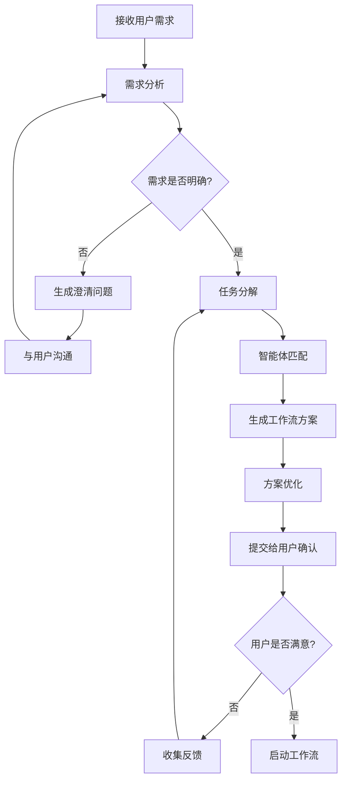

#### 2. 任务管理器 (Task Manager)

**职责**：
- 任务生命周期管理
- 任务依赖关系维护
- 任务状态跟踪
- 任务版本控制

**数据模型**：
```typescript
interface Task {
  id: string;
  title: string;
  description: string;
  type: TaskType;
  status: TaskStatus;
  priority: Priority;
  assignedAgent: AgentType;
  dependencies: string[];
  estimatedDuration: number;
  actualDuration?: number;
  input: any;
  output?: any;
  metadata: TaskMetadata;
  version: number;
  createdAt: Date;
  updatedAt: Date;
}

interface TaskMetadata {
  tags: string[];
  complexity: 'low' | 'medium' | 'high';
  requiredCapabilities: string[];
  contextData: Record<string, any>;
}
```

#### 3. 工作流引擎 (Workflow Engine)

**职责**：
- 工作流执行调度
- 任务并行/串行控制
- 异常处理和恢复
- 状态持久化

**执行策略**：
- **串行执行**：有依赖关系的任务按顺序执行
- **并行执行**：无依赖关系的任务可并行执行
- **条件执行**：根据前置任务结果决定是否执行
- **循环执行**：支持迭代优化的任务循环

#### 4. 专业智能体工作流

每个专业智能体都有标准化的工作流模式，以下是各个专业智能体的详细工作流设计：

## 创业AI智能体工作流

### 1. 创业Idea引导智能体 (IdeaGuidanceAgent)

**核心功能**：作为创业想法的"助产师"，引导用户系统化梳理和完善创业想法

**工作流程**：
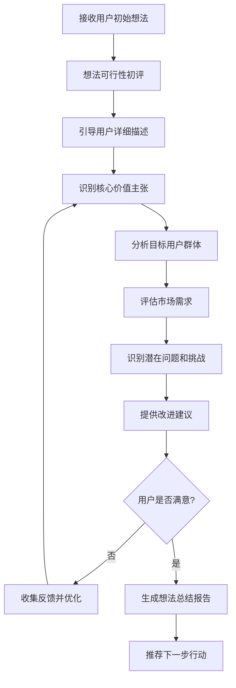

**输出节点**：
- 想法可行性评估报告
- 核心价值主张描述
- 目标用户画像
- 市场需求分析
- 改进建议清单

### 2. 商业模式画布集成智能体 (BusinessModelAgent)

**核心功能**：引导用户通过商业模式画布九大要素系统化梳理商业模式

**工作流程**：
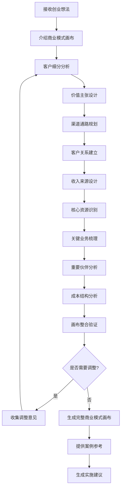

**输出节点**：
- 完整商业模式画布
- 各要素详细分析报告
- 相关案例参考
- 模式优化建议
- 实施路线图

### 3. SWOT分析工具智能体 (SWOTAnalysisAgent)

**核心功能**：引导用户进行全面的SWOT分析，评估内外环境

**工作流程**：
```mermaid
flowchart TD
    A[接收项目信息] --> B[内部环境分析]
    B --> C[优势(Strengths)识别]
    C --> D[劣势(Weaknesses)分析]
    D --> E[外部环境分析]
    E --> F[机会(Opportunities)识别]
    F --> G[威胁(Threats)评估]
    G --> H[SWOT矩阵构建]
    H --> I[交叉分析策略]
    I --> J[SO策略(优势-机会)]
    J --> K[WO策略(劣势-机会)]
    K --> L[ST策略(优势-威胁)]
    L --> M[WT策略(劣势-威胁)]
    M --> N[策略优先级排序]
    N --> O[生成SWOT分析报告]
```

**输出节点**：
- SWOT分析矩阵
- 四象限策略建议
- 风险评估报告
- 机会优先级排序
- 行动计划建议

### 4. 竞品分析模块智能体 (CompetitorAnalysisAgent)

**核心功能**：引导用户分析竞争对手，找到差异化优势

**工作流程**：
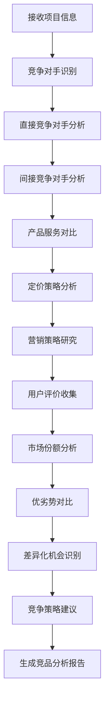

**输出节点**：
- 竞争对手清单
- 产品功能对比表
- 定价策略分析
- 市场定位图
- 差异化建议

### 5. 创新思维激发智能体 (InnovationThinkingAgent)

**核心功能**：运用SCAMPER、头脑风暴等工具激发创新思维

**工作流程**：
```mermaid
flowchart TD
    A[接收创业想法] --> B[选择创新工具]
    B --> C{工具类型}
    C -->|SCAMPER| D[SCAMPER分析]
    C -->|头脑风暴| E[头脑风暴会议]
    C -->|六顶思考帽| F[六顶思考帽分析]
    D --> G[替代(Substitute)]
    G --> H[组合(Combine)]
    H --> I[适应(Adapt)]
    I --> J[修改(Modify)]
    J --> K[其他用途(Put to other uses)]
    K --> L[消除(Eliminate)]
    L --> M[重新安排(Rearrange)]
    E --> N[发散思维阶段]
    N --> O[收敛思维阶段]
    F --> P[多角度思考]
    M --> Q[创新点整理]
    O --> Q
    P --> Q
    Q --> R[创新点评估]
    R --> S[可行性分析]
    S --> T[生成创新建议报告]
```

**输出节点**：
- 创新点清单
- 可行性评估
- 实施难度分析
- 创新价值评估
- 优先级建议

## 创业比赛咨询类智能体工作流

### 6. 商业计划书指导智能体 (BusinessPlanAgent)

**核心功能**：提供商业计划书的结构化指导和AI辅助写作

**工作流程**：
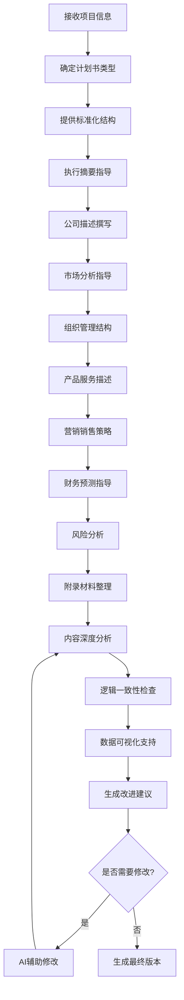

**输出节点**：
- 完整商业计划书
- 各章节写作要点
- 数据图表支持
- 逻辑分析报告
- 优化建议清单

### 7. 商业计划书评委智能体 (BusinessPlanJudgeAgent)

**核心功能**：模拟评委视角，提供多维度评估和改进建议

**工作流程**：
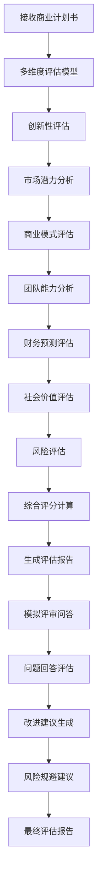

**输出节点**：
- 多维度评分表
- 详细评估报告
- 优缺点分析
- 风险提示
- 改进建议

### 8. 路演指导智能体 (PitchGuidanceAgent)

**核心功能**：提供路演PPT优化、演讲指导和模拟训练

**工作流程**：
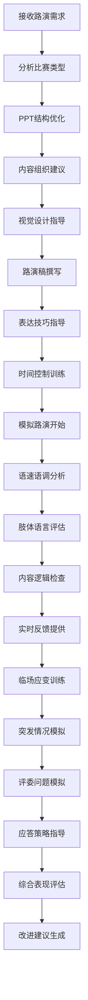

**输出节点**：
- 优化后的路演PPT
- 路演稿和演讲要点
- 表现评估报告
- 改进建议清单
- 应变策略手册

### 9. 创业大赛信息匹配智能体 (CompetitionMatchAgent)

**核心功能**：智能匹配合适的创业大赛信息

**工作流程**：
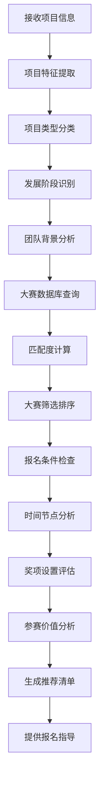

**输出节点**：
- 匹配大赛清单
- 匹配度评分
- 报名时间表
- 参赛要求清单
- 价值分析报告

### 10. 参赛团队组建智能体 (TeamBuildingAgent)

**核心功能**：推荐团队成员角色和提供协作建议

**工作流程**：
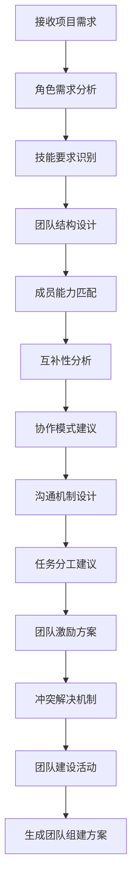

**输出节点**：
- 团队角色清单
- 能力要求描述
- 协作建议方案
- 团队管理指南
- 激励机制设计

## 政策咨询类智能体工作流

### 11. 政策条文解析智能体 (PolicyAnalysisAgent)

**核心功能**：整合多源政策信息，提供智能问答和解析

**工作流程**：
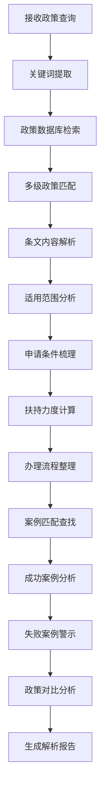

**输出节点**：
- 政策条文解析
- 适用条件清单
- 申请流程图
- 案例参考库
- 对比分析报告

### 12. 政策匹配服务智能体 (PolicyMatchAgent)

**核心功能**：根据项目特点智能推荐最适合的政策

**工作流程**：
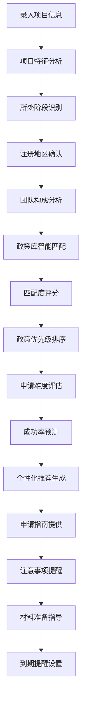

**输出节点**：
- 个性化政策推荐
- 申请指南文档
- 材料准备清单
- 时间节点提醒
- 成功率评估

### 13. 政策申报流程指导智能体 (PolicyApplicationAgent)

**核心功能**：详细指导政策申报的完整流程

**工作流程**：
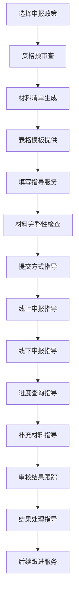

**输出节点**：
- 申报流程图
- 材料模板库
- 填写指导手册
- 进度跟踪系统
- 结果处理指南

### 14. 政策风险评估智能体 (PolicyRiskAgent)

**核心功能**：评估政策申请过程中的风险并提供规避建议

**工作流程**：
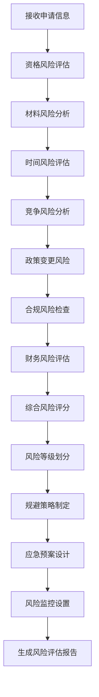

**输出节点**：
- 风险评估报告
- 风险等级评定
- 规避策略建议
- 应急预案
- 监控预警系统

## 创业诊断专家智能体工作流

### 15. 多维度诊断模型智能体 (DiagnosisAgent)

**核心功能**：全面诊断创业项目的各个维度

**工作流程**：
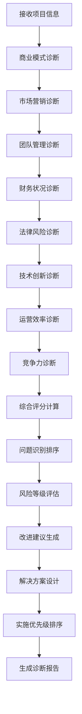

**输出节点**：
- 多维度诊断报告
- 问题清单排序
- 风险评估结果
- 改进建议方案
- 实施路线图

### 16. 财务健康诊断智能体 (FinanceDiagnosisAgent)

**核心功能**：专注于创业项目的财务状况诊断

**工作流程**：
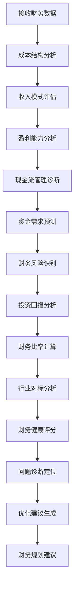

**输出节点**：
- 财务健康评分
- 成本优化建议
- 现金流预测
- 融资需求分析
- 财务风险报告

### 17. 法律合规诊断智能体 (LegalComplianceAgent)

**核心功能**：诊断创业项目的法律合规问题

**工作流程**：
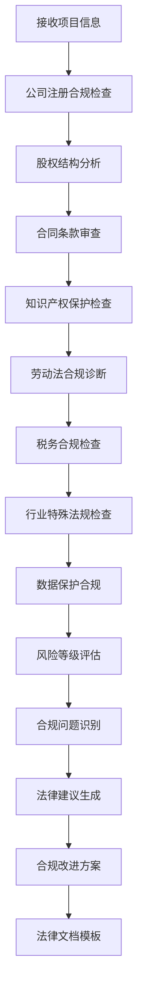

**输出节点**：
- 法律合规报告
- 风险问题清单
- 合规改进建议
- 法律文档模板
- 专业律师推荐

## 新增功能模块智能体工作流

### 18. 投融资对接智能体 (InvestmentAgent)

**核心功能**：提供投融资方案设计和对接服务

**工作流程**：
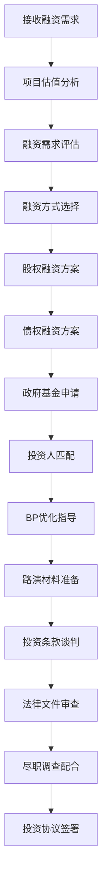

**输出节点**：
- 融资方案设计
- 投资人推荐清单
- 优化后的BP
- 路演材料包
- 法律文件模板

### 19. 团队建设与管理智能体 (TeamManagementAgent)

**核心功能**：提供团队建设和管理的全方位指导

**工作流程**：
```mermaid
flowchart TD
    A[接收团队信息] --> B[团队角色分析]
    B --> C[能力互补性评估]
    C --> D[股权分配建议]
    D --> E[激励机制设计]
    E --> F[绩效考核体系]
    F --> G[招聘策略制定]
    G --> H[面试技巧指导]
    H --> I[人才引进渠道]
    I --> J[团队文化建设]
    J --> K[沟通机制设计]
    K --> L[冲突解决方案]
    L --> M[团队发展规划]
```

**输出节点**：
- 团队分析报告
- 股权分配方案
- 激励机制设计
- 招聘策略指南
- 团队管理手册

### 20. 知识产权保护智能体 (IPProtectionAgent)

**核心功能**：提供知识产权识别、申请和保护指导

**工作流程**：
```mermaid
flowchart TD
    A[接收项目信息] --> B[知识产权类型识别]
    B --> C[专利申请评估]
    C --> D[商标注册指导]
    D --> E[著作权保护]
    E --> F[商业秘密保护]
    F --> G[申请流程指导]
    G --> H[申请材料准备]
    H --> I[侵权风险评估]
    I --> J[保护策略制定]
    J --> K[维权方案设计]
    K --> L[国际保护规划]
    L --> M[IP价值评估]
```

**输出节点**：
- IP类型识别报告
- 申请指导文档
- 保护策略方案
- 侵权风险评估
- 维权行动指南

### 21. 市场营销与品牌建设智能体 (MarketingAgent)

**核心功能**：提供市场营销和品牌建设的全方位指导

**工作流程**：
```mermaid
flowchart TD
    A[接收产品信息] --> B[市场定位分析]
    B --> C[目标用户画像]
    C --> D[竞争定位分析]
    D --> E[品牌形象设计]
    E --> F[营销策略制定]
    F --> G[线上推广方案]
    G --> H[线下活动策划]
    H --> I[内容营销规划]
    I --> J[社交媒体运营]
    J --> K[品牌传播策略]
    K --> L[效果监测体系]
    L --> M[营销预算分配]
```

**输出节点**：
- 市场定位报告
- 用户画像分析
- 品牌设计建议
- 营销策略方案
- 推广执行计划

### 22. 财税法务咨询智能体 (TaxLegalAgent)

**核心功能**：提供财税法务的专业咨询服务

**工作流程**：
```mermaid
flowchart TD
    A[接收咨询需求] --> B[公司注册指导]
    B --> C[税务登记流程]
    C --> D[工商变更指导]
    D --> E[财税政策解读]
    E --> F[税务筹划建议]
    F --> G[合同范本提供]
    G --> H[合同条款审查]
    H --> I[劳动合同指导]
    I --> J[合作协议审查]
    J --> K[法律风险评估]
    K --> L[合规建议提供]
    L --> M[专业服务推荐]
```

**输出节点**：
- 注册指导手册
- 税务筹划方案
- 合同模板库
- 法律风险报告
- 专业服务推荐

## 组件和接口

### 1. 前台编排智能体接口

```typescript
interface FrontendOrchestrator {
  // 需求分析
  analyzeRequirement(userInput: string, context: UserContext): Promise<RequirementAnalysis>;
  
  // 生成澄清问题
  generateClarificationQuestions(analysis: RequirementAnalysis): Promise<Question[]>;
  
  // 任务分解
  decomposeTask(requirement: Requirement): Promise<TaskPlan>;
  
  // 智能体匹配
  matchAgents(tasks: Task[]): Promise<AgentAssignment[]>;
  
  // 生成工作流
  generateWorkflow(tasks: Task[], assignments: AgentAssignment[]): Promise<Workflow>;
  
  // 优化工作流
  optimizeWorkflow(workflow: Workflow, constraints: Constraint[]): Promise<Workflow>;
}

interface RequirementAnalysis {
  intent: string;
  entities: Entity[];
  confidence: number;
  complexity: ComplexityLevel;
  clarificationNeeded: boolean;
  suggestedAgents: AgentType[];
}
```

### 2. 任务编辑器接口

```typescript
interface TaskEditor {
  // 任务CRUD操作
  createTask(taskData: CreateTaskRequest): Promise<Task>;
  updateTask(taskId: string, updates: UpdateTaskRequest): Promise<Task>;
  deleteTask(taskId: string): Promise<void>;
  
  // 任务重排序
  reorderTasks(workflowId: string, taskOrder: string[]): Promise<Workflow>;
  
  // 依赖关系管理
  addDependency(taskId: string, dependencyId: string): Promise<void>;
  removeDependency(taskId: string, dependencyId: string): Promise<void>;
  validateDependencies(workflow: Workflow): Promise<ValidationResult>;
  
  // 批量操作
  batchUpdateTasks(updates: BatchTaskUpdate[]): Promise<Task[]>;
}
```

### 3. 任务转交器接口

```typescript
interface TaskTransfer {
  // 转交任务
  transferTask(taskId: string, fromAgent: AgentType, toAgent: AgentType, reason: string): Promise<TransferResult>;
  
  // 检查转交可行性
  checkTransferFeasibility(taskId: string, targetAgent: AgentType): Promise<FeasibilityCheck>;
  
  // 获取转交建议
  getTransferSuggestions(taskId: string): Promise<TransferSuggestion[]>;
  
  // 转交历史
  getTransferHistory(taskId: string): Promise<TransferRecord[]>;
  
  // 回滚转交
  rollbackTransfer(transferId: string): Promise<void>;
}

interface TransferResult {
  success: boolean;
  transferId: string;
  message: string;
  newAssignment: AgentAssignment;
}
```

### 4. 专业智能体基础接口

```typescript
interface SpecializedAgent {
  // 基础信息
  getAgentInfo(): AgentInfo;
  getCapabilities(): Capability[];
  
  // 任务执行
  executeTask(task: Task): Promise<TaskResult>;
  
  // 状态报告
  reportProgress(taskId: string): Promise<ProgressReport>;
  
  // 协作接口
  requestAssistance(taskId: string, assistanceType: AssistanceType): Promise<AssistanceResponse>;
  provideAssistance(requestId: string, assistance: Assistance): Promise<void>;
  
  // 工作流控制
  pauseTask(taskId: string): Promise<void>;
  resumeTask(taskId: string): Promise<void>;
  cancelTask(taskId: string): Promise<void>;
}

// 创业AI智能体类型枚举
enum StartupAgentType {
  IDEA_GUIDANCE = 'idea-guidance',
  BUSINESS_MODEL = 'business-model',
  SWOT_ANALYSIS = 'swot-analysis',
  COMPETITOR_ANALYSIS = 'competitor-analysis',
  INNOVATION_THINKING = 'innovation-thinking'
}

// 创业比赛咨询智能体类型
enum CompetitionAgentType {
  BUSINESS_PLAN = 'business-plan',
  BUSINESS_PLAN_JUDGE = 'business-plan-judge',
  PITCH_GUIDANCE = 'pitch-guidance',
  COMPETITION_MATCH = 'competition-match',
  TEAM_BUILDING = 'team-building'
}

// 政策咨询智能体类型
enum PolicyAgentType {
  POLICY_ANALYSIS = 'policy-analysis',
  POLICY_MATCH = 'policy-match',
  POLICY_APPLICATION = 'policy-application',
  POLICY_RISK = 'policy-risk'
}

// 诊断专家智能体类型
enum DiagnosisAgentType {
  MULTI_DIAGNOSIS = 'multi-diagnosis',
  FINANCE_DIAGNOSIS = 'finance-diagnosis',
  LEGAL_COMPLIANCE = 'legal-compliance'
}

// 新增功能智能体类型
enum ExtendedAgentType {
  INVESTMENT = 'investment',
  TEAM_MANAGEMENT = 'team-management',
  IP_PROTECTION = 'ip-protection',
  MARKETING = 'marketing',
  TAX_LEGAL = 'tax-legal'
}

// 智能体能力定义
interface AgentCapability {
  id: string;
  name: string;
  description: string;
  inputTypes: string[];
  outputTypes: string[];
  complexity: 'low' | 'medium' | 'high';
  estimatedDuration: number;
  requiredResources: string[];
}

// 智能体信息
interface AgentInfo {
  id: string;
  name: string;
  type: StartupAgentType | CompetitionAgentType | PolicyAgentType | DiagnosisAgentType | ExtendedAgentType;
  version: string;
  description: string;
  capabilities: AgentCapability[];
  status: 'active' | 'inactive' | 'maintenance';
  loadFactor: number;
  maxConcurrentTasks: number;
}

// 专业智能体特定接口
interface StartupIdeaGuidanceAgent extends SpecializedAgent {
  analyzeIdea(idea: string): Promise<IdeaAnalysis>;
  generateClarificationQuestions(analysis: IdeaAnalysis): Promise<Question[]>;
  provideFeedback(userResponse: string): Promise<Feedback>;
  generateImprovementSuggestions(idea: IdeaAnalysis): Promise<Suggestion[]>;
}

interface BusinessModelAgent extends SpecializedAgent {
  generateBusinessModelCanvas(idea: string): Promise<BusinessModelCanvas>;
  analyzeCanvasElement(element: CanvasElement, data: any): Promise<ElementAnalysis>;
  validateBusinessModel(canvas: BusinessModelCanvas): Promise<ValidationResult>;
  provideCaseReferences(canvas: BusinessModelCanvas): Promise<CaseReference[]>;
}

interface SWOTAnalysisAgent extends SpecializedAgent {
  conductSWOTAnalysis(projectInfo: ProjectInfo): Promise<SWOTMatrix>;
  generateStrategies(swotMatrix: SWOTMatrix): Promise<StrategicOptions>;
  prioritizeStrategies(strategies: StrategicOptions): Promise<PriorityList>;
  generateActionPlan(prioritizedStrategies: PriorityList): Promise<ActionPlan>;
}

interface CompetitorAnalysisAgent extends SpecializedAgent {
  identifyCompetitors(projectInfo: ProjectInfo): Promise<CompetitorList>;
  analyzeCompetitor(competitor: Competitor): Promise<CompetitorAnalysis>;
  generateCompetitiveMatrix(analyses: CompetitorAnalysis[]): Promise<CompetitiveMatrix>;
  identifyDifferentiation(matrix: CompetitiveMatrix): Promise<DifferentiationOpportunity[]>;
}

interface PolicyAnalysisAgent extends SpecializedAgent {
  searchPolicies(query: string, location: string): Promise<PolicySearchResult[]>;
  analyzePolicyContent(policyId: string): Promise<PolicyAnalysis>;
  comparePolices(policyIds: string[]): Promise<PolicyComparison>;
  generateApplicationGuide(policyId: string): Promise<ApplicationGuide>;
}
```

## 数据模型

### 工作流数据模型

```typescript
interface Workflow {
  id: string;
  name: string;
  description: string;
  status: WorkflowStatus;
  tasks: Task[];
  dependencies: TaskDependency[];
  metadata: WorkflowMetadata;
  version: number;
  createdBy: string;
  createdAt: Date;
  updatedAt: Date;
  startedAt?: Date;
  completedAt?: Date;
}

interface TaskDependency {
  taskId: string;
  dependsOn: string[];
  type: DependencyType; // 'finish-to-start' | 'start-to-start' | 'finish-to-finish'
}

interface WorkflowMetadata {
  estimatedDuration: number;
  actualDuration?: number;
  complexity: ComplexityLevel;
  tags: string[];
  category: string;
  priority: Priority;
}
```

### 智能体协作数据模型

```typescript
interface AgentCollaboration {
  id: string;
  workflowId: string;
  participants: AgentType[];
  collaborationType: CollaborationType;
  sharedContext: SharedContext;
  communicationLog: CommunicationRecord[];
  status: CollaborationStatus;
}

interface SharedContext {
  data: Record<string, any>;
  files: FileReference[];
  variables: Variable[];
  constraints: Constraint[];
}

interface CommunicationRecord {
  id: string;
  fromAgent: AgentType;
  toAgent: AgentType;
  messageType: MessageType;
  content: any;
  timestamp: Date;
}

// 创业相关数据模型
interface IdeaAnalysis {
  id: string;
  originalIdea: string;
  coreValueProposition: string;
  targetUsers: UserSegment[];
  marketNeed: MarketNeedAssessment;
  feasibilityScore: number;
  improvementAreas: string[];
  nextSteps: string[];
}

interface BusinessModelCanvas {
  id: string;
  customerSegments: CustomerSegment[];
  valuePropositions: ValueProposition[];
  channels: Channel[];
  customerRelationships: CustomerRelationship[];
  revenueStreams: RevenueStream[];
  keyResources: KeyResource[];
  keyActivities: KeyActivity[];
  keyPartnerships: KeyPartnership[];
  costStructure: CostStructure;
  validationStatus: ValidationStatus;
}

interface SWOTMatrix {
  id: string;
  strengths: SWOTItem[];
  weaknesses: SWOTItem[];
  opportunities: SWOTItem[];
  threats: SWOTItem[];
  strategicOptions: StrategicOption[];
  priorityMatrix: PriorityMatrix;
}

interface CompetitorAnalysis {
  id: string;
  competitor: Competitor;
  productAnalysis: ProductAnalysis;
  pricingStrategy: PricingStrategy;
  marketingStrategy: MarketingStrategy;
  strengths: string[];
  weaknesses: string[];
  marketShare: number;
  differentiationOpportunities: string[];
}

interface PolicyAnalysis {
  id: string;
  policyId: string;
  title: string;
  applicableScope: string[];
  applicationConditions: Condition[];
  supportLevel: SupportLevel;
  applicationProcess: ProcessStep[];
  requiredDocuments: Document[];
  successCases: Case[];
  failureCases: Case[];
  riskAssessment: RiskAssessment;
}

interface BusinessPlanEvaluation {
  id: string;
  planId: string;
  evaluationDimensions: EvaluationDimension[];
  overallScore: number;
  strengths: string[];
  weaknesses: string[];
  improvementSuggestions: Suggestion[];
  riskWarnings: RiskWarning[];
  competitiveAdvantages: string[];
}

interface PitchEvaluation {
  id: string;
  pitchId: string;
  contentScore: number;
  deliveryScore: number;
  visualScore: number;
  timeManagement: number;
  audienceEngagement: number;
  overallScore: number;
  feedback: PitchFeedback[];
  improvementAreas: string[];
}

// 支持数据类型
interface UserSegment {
  name: string;
  description: string;
  size: number;
  characteristics: string[];
  painPoints: string[];
  willingness: number;
}

interface MarketNeedAssessment {
  needLevel: 'low' | 'medium' | 'high';
  marketSize: number;
  growthRate: number;
  competitionLevel: 'low' | 'medium' | 'high';
  barriers: string[];
}

interface SWOTItem {
  category: 'strength' | 'weakness' | 'opportunity' | 'threat';
  description: string;
  impact: number;
  confidence: number;
  evidence: string[];
}

interface Competitor {
  id: string;
  name: string;
  type: 'direct' | 'indirect';
  website: string;
  description: string;
  foundedYear: number;
  funding: FundingInfo;
  teamSize: number;
}

interface EvaluationDimension {
  name: string;
  weight: number;
  score: number;
  maxScore: number;
  criteria: EvaluationCriteria[];
  feedback: string;
}

interface ProcessStep {
  stepNumber: number;
  title: string;
  description: string;
  requiredDocuments: string[];
  estimatedDuration: number;
  responsible: string;
  notes: string[];
}
```

## 错误处理

### 错误分类和处理策略

#### 1. 任务执行错误
- **超时错误**：设置合理超时时间，支持任务重试
- **资源不足**：实现资源队列和优先级调度
- **依赖失败**：提供依赖跳过和替代方案
- **智能体故障**：自动故障转移到备用智能体

#### 2. 工作流编排错误
- **循环依赖**：依赖关系验证和环检测
- **资源冲突**：资源锁定和冲突解决
- **版本冲突**：版本管理和合并策略
- **权限错误**：权限检查和授权机制

#### 3. 通信错误
- **网络异常**：重试机制和降级策略
- **消息丢失**：消息确认和重发机制
- **协议错误**：协议版本兼容和转换
- **序列化错误**：数据格式验证和转换

### 错误恢复机制

```typescript
interface ErrorRecovery {
  // 自动恢复
  autoRecover(error: WorkflowError): Promise<RecoveryResult>;
  
  // 手动干预
  requestManualIntervention(error: WorkflowError): Promise<InterventionRequest>;
  
  // 回滚操作
  rollback(workflowId: string, checkpointId: string): Promise<void>;
  
  // 检查点管理
  createCheckpoint(workflowId: string): Promise<Checkpoint>;
  listCheckpoints(workflowId: string): Promise<Checkpoint[]>;
}
```

## 测试策略

### 单元测试
- 前台编排智能体的需求分析准确性测试
- 任务管理器的CRUD操作测试
- 工作流引擎的调度逻辑测试
- 专业智能体的工作流执行测试

### 集成测试
- 多智能体协作流程端到端测试
- 任务转交机制测试
- 错误处理和恢复测试
- 性能和并发测试

### 用户体验测试
- 工作流编辑界面可用性测试
- 实时监控和反馈测试
- 多轮对话和澄清测试
- 复杂工作流场景测试

## 性能优化

### 执行优化
- **并行执行**：最大化任务并行度
- **资源池化**：智能体实例复用
- **缓存机制**：结果缓存和智能推荐
- **负载均衡**：智能体负载分配

### 通信优化
- **异步消息**：非阻塞通信机制
- **批量操作**：减少网络往返
- **压缩传输**：数据压缩和优化
- **连接复用**：长连接和连接池

### 存储优化
- **数据分片**：大规模工作流数据分片
- **索引优化**：查询性能优化
- **归档机制**：历史数据归档
- **备份策略**：数据备份和恢复

## 安全考虑

### 访问控制
- **身份认证**：用户身份验证机制
- **权限管理**：基于角色的访问控制
- **资源隔离**：多租户资源隔离
- **审计日志**：操作审计和追踪

### 数据安全
- **数据加密**：传输和存储加密
- **敏感信息**：敏感数据脱敏
- **数据完整性**：数据校验和签名
- **隐私保护**：个人信息保护

### 系统安全
- **输入验证**：用户输入验证和过滤
- **注入防护**：SQL注入和代码注入防护
- **DDoS防护**：分布式拒绝服务攻击防护
- **漏洞扫描**：定期安全漏洞扫描

## 监控和分析

### 实时监控
- **工作流状态**：实时工作流执行状态
- **智能体性能**：智能体响应时间和成功率
- **资源使用**：CPU、内存、网络使用情况
- **错误率**：系统错误率和异常统计

### 分析报告
- **执行分析**：工作流执行效率分析
- **性能分析**：系统性能瓶颈分析
- **用户行为**：用户使用模式分析
- **优化建议**：基于数据的优化建议

### 告警机制
- **阈值告警**：性能指标阈值告警
- **异常告警**：系统异常和错误告警
- **业务告警**：业务指标异常告警
- **预测告警**：基于趋势的预测告警