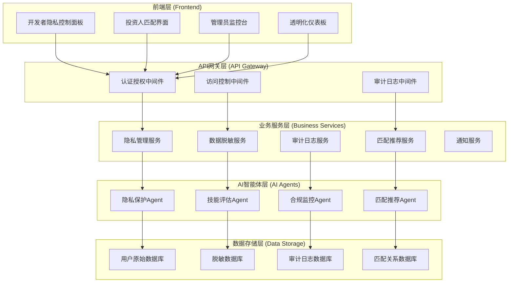
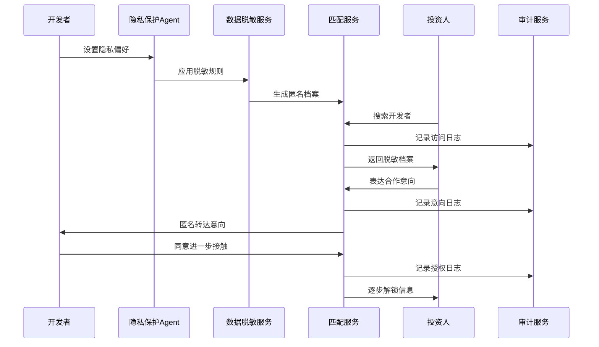

# 设计文档

## 概述

隐私保护的开发者资料收集与匹配系统是一个集成到创业星球平台的核心功能模块，旨在解决传统黑客松比赛中参赛者信息被非法收集和出售的问题。系统通过数据脱敏、权限控制、透明化机制和AI智能匹配，在保护开发者隐私的同时为投资人提供合法的人才发现服务。

## 架构

### 系统架构图



### 数据流架构



## 组件和接口

### 1. 隐私管理服务 (PrivacyManagementService)

**职责**: 管理开发者的隐私设置和数据访问权限

**核心接口**:
```typescript
interface PrivacyManagementService {
  // 隐私设置管理
  updatePrivacySettings(userId: string, settings: PrivacySettings): Promise<void>;
  getPrivacySettings(userId: string): Promise<PrivacySettings>;
  
  // 数据访问授权
  grantDataAccess(userId: string, requesterId: string, scope: AccessScope): Promise<string>;
  revokeDataAccess(userId: string, accessToken: string): Promise<void>;
  
  // 权限验证
  validateAccess(accessToken: string, dataType: DataType): Promise<boolean>;
}

interface PrivacySettings {
  profileVisibility: VisibilityLevel;
  skillsVisibility: VisibilityLevel;
  projectsVisibility: VisibilityLevel;
  contactPermission: ContactPermission;
  dataRetentionPeriod: number; // 天数
  allowAIAnalysis: boolean;
  allowAnonymousMatching: boolean;
}

enum VisibilityLevel {
  PRIVATE = 'private',
  ANONYMOUS = 'anonymous',
  SEMI_PUBLIC = 'semi_public',
  PUBLIC = 'public'
}
```

### 2. 数据脱敏服务 (DataAnonymizationService)

**职责**: 对开发者数据进行脱敏处理，生成匿名化档案

**核心接口**:
```typescript
interface DataAnonymizationService {
  // 数据脱敏
  anonymizeProfile(profile: DeveloperProfile): Promise<AnonymizedProfile>;
  anonymizeProject(project: ProjectData): Promise<AnonymizedProject>;
  
  // 脱敏规则管理
  addAnonymizationRule(rule: AnonymizationRule): Promise<void>;
  updateAnonymizationRule(ruleId: string, rule: AnonymizationRule): Promise<void>;
  
  // 数据恢复（仅限授权情况）
  deanonymizeData(anonymizedId: string, accessToken: string): Promise<OriginalData>;
}

interface AnonymizedProfile {
  anonymousId: string;
  skillTags: string[];
  experienceLevel: ExperienceLevel;
  projectSummaries: AnonymizedProject[];
  performanceMetrics: PerformanceMetrics;
  availabilityStatus: AvailabilityStatus;
  locationRegion: string; // 模糊化的地理位置
  preferredCollaboration: CollaborationType[];
}

interface AnonymizationRule {
  id: string;
  dataType: DataType;
  method: AnonymizationMethod;
  parameters: Record<string, any>;
  priority: number;
}

enum AnonymizationMethod {
  REMOVE = 'remove',
  MASK = 'mask',
  GENERALIZE = 'generalize',
  SUBSTITUTE = 'substitute',
  NOISE_ADDITION = 'noise_addition'
}
```

### 3. 匹配推荐服务 (MatchingRecommendationService)

**职责**: 基于脱敏数据进行开发者与投资人的智能匹配

**核心接口**:
```typescript
interface MatchingRecommendationService {
  // 开发者推荐
  recommendDevelopers(criteria: InvestorCriteria): Promise<DeveloperMatch[]>;
  
  // 投资机会推荐
  recommendOpportunities(developerId: string): Promise<OpportunityMatch[]>;
  
  // 匹配意向处理
  expressInterest(investorId: string, developerId: string, message: string): Promise<InterestRequest>;
  respondToInterest(developerId: string, requestId: string, response: InterestResponse): Promise<void>;
  
  // 匹配历史
  getMatchingHistory(userId: string): Promise<MatchingHistory[]>;
}

interface InvestorCriteria {
  skillRequirements: SkillRequirement[];
  experienceLevel: ExperienceLevel[];
  projectTypes: ProjectType[];
  locationPreference?: string;
  availabilityRequirement: AvailabilityStatus;
  budgetRange?: BudgetRange;
}

interface DeveloperMatch {
  anonymousId: string;
  matchScore: number;
  matchReasons: string[];
  profile: AnonymizedProfile;
  estimatedCollaborationFit: number;
}
```

### 4. 审计日志服务 (AuditLogService)

**职责**: 记录所有数据访问和操作行为，确保透明度和合规性

**核心接口**:
```typescript
interface AuditLogService {
  // 日志记录
  logDataAccess(event: DataAccessEvent): Promise<void>;
  logPrivacyChange(event: PrivacyChangeEvent): Promise<void>;
  logMatchingActivity(event: MatchingEvent): Promise<void>;
  
  // 日志查询
  getUserAccessLogs(userId: string, timeRange: TimeRange): Promise<AccessLog[]>;
  getSystemAuditLogs(filters: AuditFilters): Promise<AuditLog[]>;
  
  // 合规报告
  generateComplianceReport(timeRange: TimeRange): Promise<ComplianceReport>;
}

interface DataAccessEvent {
  timestamp: Date;
  accessorId: string;
  accessorType: UserType;
  targetUserId: string;
  dataType: DataType;
  accessMethod: AccessMethod;
  ipAddress: string;
  userAgent: string;
  purpose: string;
}
```

### 5. AI智能体集成

**隐私保护Agent**:
```typescript
interface PrivacyProtectionAgent extends AgentInfo {
  // 隐私风险评估
  assessPrivacyRisk(data: any): Promise<PrivacyRiskAssessment>;
  
  // 自动脱敏建议
  suggestAnonymization(profile: DeveloperProfile): Promise<AnonymizationSuggestion[]>;
  
  // 合规检查
  checkCompliance(operation: DataOperation): Promise<ComplianceResult>;
}

interface SkillAssessmentAgent extends AgentInfo {
  // 技能档案生成
  generateSkillProfile(codeData: CodeAnalysisData): Promise<SkillProfile>;
  
  // 能力评估
  assessCapabilities(projectHistory: ProjectData[]): Promise<CapabilityAssessment>;
  
  // 成长轨迹分析
  analyzeGrowthTrajectory(timeSeriesData: DevelopmentData[]): Promise<GrowthAnalysis>;
}
```

## 数据模型

### 核心数据实体

```typescript
// 开发者档案
interface DeveloperProfile {
  id: string;
  userId: string;
  personalInfo: PersonalInfo;
  skills: Skill[];
  projects: ProjectData[];
  experience: ExperienceRecord[];
  preferences: DeveloperPreferences;
  privacySettings: PrivacySettings;
  createdAt: Date;
  updatedAt: Date;
}

// 投资人档案
interface InvestorProfile {
  id: string;
  userId: string;
  companyInfo: CompanyInfo;
  investmentFocus: InvestmentFocus[];
  criteria: InvestorCriteria;
  verificationStatus: VerificationStatus;
  accessHistory: AccessRecord[];
  createdAt: Date;
  updatedAt: Date;
}

// 匹配记录
interface MatchingRecord {
  id: string;
  developerId: string;
  investorId: string;
  matchScore: number;
  status: MatchingStatus;
  interactionHistory: InteractionRecord[];
  privacyLevel: PrivacyLevel;
  createdAt: Date;
  updatedAt: Date;
}

// 审计日志
interface AuditLog {
  id: string;
  eventType: EventType;
  userId: string;
  targetId?: string;
  action: string;
  details: Record<string, any>;
  ipAddress: string;
  userAgent: string;
  timestamp: Date;
  complianceFlags: string[];
}
```

### 数据库设计

```sql
-- 用户隐私设置表
CREATE TABLE privacy_settings (
  id UUID PRIMARY KEY DEFAULT gen_random_uuid(),
  user_id UUID NOT NULL REFERENCES users(id),
  profile_visibility VARCHAR(20) NOT NULL DEFAULT 'anonymous',
  skills_visibility VARCHAR(20) NOT NULL DEFAULT 'anonymous',
  projects_visibility VARCHAR(20) NOT NULL DEFAULT 'anonymous',
  contact_permission VARCHAR(20) NOT NULL DEFAULT 'request_only',
  data_retention_days INTEGER NOT NULL DEFAULT 365,
  allow_ai_analysis BOOLEAN NOT NULL DEFAULT true,
  allow_anonymous_matching BOOLEAN NOT NULL DEFAULT true,
  created_at TIMESTAMP WITH TIME ZONE DEFAULT NOW(),
  updated_at TIMESTAMP WITH TIME ZONE DEFAULT NOW()
);

-- 脱敏档案表
CREATE TABLE anonymized_profiles (
  id UUID PRIMARY KEY DEFAULT gen_random_uuid(),
  anonymous_id VARCHAR(50) UNIQUE NOT NULL,
  original_user_id UUID NOT NULL REFERENCES users(id),
  skill_tags TEXT[] NOT NULL,
  experience_level VARCHAR(20) NOT NULL,
  performance_score DECIMAL(3,2),
  location_region VARCHAR(100),
  availability_status VARCHAR(20),
  profile_data JSONB NOT NULL,
  created_at TIMESTAMP WITH TIME ZONE DEFAULT NOW(),
  updated_at TIMESTAMP WITH TIME ZONE DEFAULT NOW()
);

-- 访问授权表
CREATE TABLE access_grants (
  id UUID PRIMARY KEY DEFAULT gen_random_uuid(),
  grantor_id UUID NOT NULL REFERENCES users(id),
  grantee_id UUID NOT NULL REFERENCES users(id),
  access_token VARCHAR(255) UNIQUE NOT NULL,
  scope TEXT[] NOT NULL,
  expires_at TIMESTAMP WITH TIME ZONE NOT NULL,
  revoked_at TIMESTAMP WITH TIME ZONE,
  created_at TIMESTAMP WITH TIME ZONE DEFAULT NOW()
);

-- 审计日志表
CREATE TABLE audit_logs (
  id UUID PRIMARY KEY DEFAULT gen_random_uuid(),
  event_type VARCHAR(50) NOT NULL,
  user_id UUID REFERENCES users(id),
  target_id UUID,
  action VARCHAR(100) NOT NULL,
  details JSONB,
  ip_address INET,
  user_agent TEXT,
  compliance_flags TEXT[],
  created_at TIMESTAMP WITH TIME ZONE DEFAULT NOW()
);

-- 匹配记录表
CREATE TABLE matching_records (
  id UUID PRIMARY KEY DEFAULT gen_random_uuid(),
  developer_id UUID NOT NULL REFERENCES users(id),
  investor_id UUID NOT NULL REFERENCES users(id),
  match_score DECIMAL(3,2) NOT NULL,
  status VARCHAR(20) NOT NULL DEFAULT 'pending',
  privacy_level VARCHAR(20) NOT NULL DEFAULT 'anonymous',
  interaction_data JSONB,
  created_at TIMESTAMP WITH TIME ZONE DEFAULT NOW(),
  updated_at TIMESTAMP WITH TIME ZONE DEFAULT NOW()
);
```

## 错误处理

### 错误分类和处理策略

```typescript
enum PrivacyErrorType {
  UNAUTHORIZED_ACCESS = 'UNAUTHORIZED_ACCESS',
  PRIVACY_VIOLATION = 'PRIVACY_VIOLATION',
  DATA_ANONYMIZATION_FAILED = 'DATA_ANONYMIZATION_FAILED',
  COMPLIANCE_VIOLATION = 'COMPLIANCE_VIOLATION',
  ACCESS_TOKEN_EXPIRED = 'ACCESS_TOKEN_EXPIRED',
  INSUFFICIENT_PERMISSIONS = 'INSUFFICIENT_PERMISSIONS'
}

class PrivacyError extends Error {
  constructor(
    public type: PrivacyErrorType,
    public message: string,
    public userId?: string,
    public details?: Record<string, any>
  ) {
    super(message);
    this.name = 'PrivacyError';
  }
}

// 错误处理中间件
class PrivacyErrorHandler {
  static handle(error: PrivacyError, req: Request, res: Response) {
    // 记录安全事件
    auditLogService.logSecurityEvent({
      type: error.type,
      userId: error.userId,
      details: error.details,
      request: req
    });
    
    // 通知相关用户
    if (error.userId) {
      notificationService.notifySecurityEvent(error.userId, error.type);
    }
    
    // 返回适当的错误响应
    const statusCode = this.getStatusCode(error.type);
    res.status(statusCode).json({
      error: error.type,
      message: this.getSafeMessage(error.message),
      timestamp: new Date().toISOString()
    });
  }
}
```

## 测试策略

### 1. 单元测试
- **数据脱敏算法测试**: 验证各种脱敏方法的有效性和一致性
- **权限验证测试**: 确保访问控制逻辑的正确性
- **匹配算法测试**: 验证推荐算法的准确性和公平性

### 2. 集成测试
- **端到端隐私流程测试**: 从数据收集到匹配的完整流程
- **AI Agent集成测试**: 验证智能体与服务层的协作
- **数据库事务测试**: 确保数据一致性和完整性

### 3. 安全测试
- **隐私泄露测试**: 尝试通过各种方式获取敏感信息
- **访问控制测试**: 验证未授权访问的防护
- **数据恢复测试**: 确保脱敏数据无法被逆向工程

### 4. 合规测试
- **GDPR合规测试**: 验证数据处理符合欧盟法规
- **CCPA合规测试**: 验证符合加州消费者隐私法
- **审计日志完整性测试**: 确保所有操作都被正确记录

### 测试数据管理
```typescript
class TestDataManager {
  // 生成测试用的脱敏数据
  static generateAnonymizedTestData(count: number): AnonymizedProfile[] {
    return Array.from({ length: count }, () => ({
      anonymousId: `test_${faker.datatype.uuid()}`,
      skillTags: faker.helpers.arrayElements(SKILL_TAGS, 5),
      experienceLevel: faker.helpers.arrayElement(EXPERIENCE_LEVELS),
      performanceMetrics: this.generatePerformanceMetrics(),
      locationRegion: faker.address.state(),
      availabilityStatus: faker.helpers.arrayElement(AVAILABILITY_STATUSES)
    }));
  }
  
  // 清理测试数据
  static async cleanupTestData(): Promise<void> {
    await db.query('DELETE FROM anonymized_profiles WHERE anonymous_id LIKE $1', ['test_%']);
    await db.query('DELETE FROM audit_logs WHERE details->>"test" = $1', ['true']);
  }
}
```

## 性能优化

### 1. 数据库优化
- **索引策略**: 为匿名ID、技能标签、时间戳等字段创建适当索引
- **分区策略**: 按时间对审计日志表进行分区
- **缓存策略**: 对频繁访问的脱敏档案进行Redis缓存

### 2. 算法优化
- **匹配算法优化**: 使用向量化计算加速相似度计算
- **脱敏算法优化**: 批量处理和并行化脱敏操作
- **实时推荐**: 使用机器学习模型进行实时匹配推荐

### 3. 系统架构优化
- **微服务架构**: 将隐私管理、脱敏、匹配等功能拆分为独立服务
- **异步处理**: 使用消息队列处理耗时的脱敏和匹配操作
- **CDN加速**: 对静态资源和API响应进行缓存加速