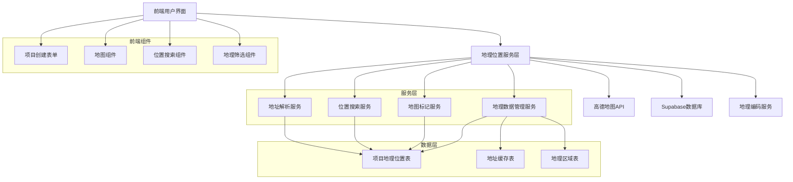

# 项目地理位置功能设计文档

## 概述

本设计文档详细描述了为创业星球平台添加完整地理位置功能的技术实现方案。该功能将增强现有的地图展示能力，添加地址解析、位置搜索、地理筛选等核心功能，提升用户体验和项目发现效率。

## 架构

### 系统架构图



### 技术栈

- **前端框架**: React 18 + TypeScript
- **地图服务**: 高德地图 Web API 2.0
- **地理编码**: 高德地图地理编码API
- **数据库**: Supabase PostgreSQL
- **状态管理**: Zustand
- **HTTP客户端**: 内置fetch API

## 组件和接口

### 1. 地理位置数据模型

#### 数据库表结构扩展

现有的 `projects` 表已包含基础地理位置字段，需要优化和扩展以支持多维度位置信息：

```sql
-- 现有字段（已存在）
latitude: number | null          -- 主要运营地点纬度
longitude: number | null         -- 主要运营地点经度
location: string | null          -- 完整地址描述
city: string | null             -- 主要运营城市
province: string | null         -- 主要运营省份
country: string | null          -- 国家

-- 建议新增字段
location_type: string | null     -- 位置类型：'physical'(实体办公), 'remote'(远程), 'hybrid'(混合)
operation_address: jsonb | null  -- 运营地点详细信息
service_areas: string[] | null   -- 服务区域列表
collaboration_mode: string | null -- 协作模式：'local_only', 'remote_friendly', 'location_flexible'
timezone: string | null          -- 主要时区
location_description: text | null -- 位置说明（如："欢迎线下交流"）
location_visibility: string | null -- 位置可见性：'public', 'city_only', 'hidden'
```

#### TypeScript接口定义

```typescript
// 地理位置接口
export interface GeoLocation {
  latitude: number;
  longitude: number;
  accuracy?: number;
}

// 地址组件接口
export interface AddressComponents {
  country?: string;
  province?: string;
  city?: string;
  district?: string;
  street?: string;
  streetNumber?: string;
  postalCode?: string;
}

// 协作偏好接口
export interface CollaborationPreference {
  mode: 'local_only' | 'remote_friendly' | 'location_flexible';
  maxDistance?: number; // 愿意线下协作的最大距离（公里）
  meetingPreference: 'online' | 'offline' | 'both';
  timeZoneFlexibility: boolean; // 是否接受跨时区协作
  description?: string; // 协作偏好说明
}

// 位置类型和可见性
export interface LocationSettings {
  type: 'physical' | 'remote' | 'hybrid';
  visibility: 'public' | 'city_only' | 'hidden';
  showExactAddress: boolean;
  allowContactForMeetup: boolean;
}

// 服务区域接口
export interface ServiceArea {
  type: 'local' | 'regional' | 'national' | 'global';
  targetRegions?: string[]; // 目标服务区域
  description?: string; // 服务范围说明
}

// 完整项目地理位置信息
export interface ProjectGeolocation {
  id: string;
  projectId: string;
  
  // 基础位置信息
  location: GeoLocation;
  address: string;
  formattedAddress: string;
  components: AddressComponents;
  
  // 协作相关设置
  locationSettings: LocationSettings;
  collaborationPreference: CollaborationPreference;
  serviceArea: ServiceArea;
  
  // 元数据
  accuracy: 'high' | 'medium' | 'low';
  source: 'user_input' | 'gps' | 'geocoded' | 'manual';
  lastVerified: string;
  createdAt: string;
  updatedAt: string;
}

// 地理搜索参数（增强版）
export interface GeoSearchParams {
  query?: string;
  center?: GeoLocation;
  radius?: number; // 搜索半径（公里）
  bounds?: {
    northeast: GeoLocation;
    southwest: GeoLocation;
  };
  city?: string;
  province?: string;
  
  // 协作相关筛选
  collaborationMode?: 'local_only' | 'remote_friendly' | 'location_flexible' | 'all';
  meetingPreference?: 'online' | 'offline' | 'both';
  locationType?: 'physical' | 'remote' | 'hybrid';
  serviceAreaType?: 'local' | 'regional' | 'national' | 'global';
}

// 项目匹配结果
export interface ProjectMatch {
  project: ProjectWithLocation;
  matchScore: number; // 匹配分数 0-100
  distance?: number; // 距离（公里）
  collaborationCompatibility: number; // 协作兼容性分数
  reasons: string[]; // 推荐原因
}
```

### 2. 地理编码服务

#### 地址解析服务

```typescript
export class GeocodeService {
  private static readonly AMAP_GEOCODE_URL = 'https://restapi.amap.com/v3/geocode/geo';
  private static readonly AMAP_REGEOCODE_URL = 'https://restapi.amap.com/v3/geocode/regeo';
  
  // 地址转坐标（地理编码）
  static async geocodeAddress(address: string): Promise<{
    location: GeoLocation | null;
    formattedAddress: string;
    components: AddressComponents;
    accuracy: string;
    error: any;
  }>;
  
  // 坐标转地址（逆地理编码）
  static async reverseGeocode(location: GeoLocation): Promise<{
    address: string;
    formattedAddress: string;
    components: AddressComponents;
    error: any;
  }>;
  
  // 地址自动补全（支持协作场所推荐）
  static async autocompleteAddress(input: string, city?: string, includeCoworkingSpaces?: boolean): Promise<{
    suggestions: AddressSuggestion[];
    coworkingSpaces?: CoworkingSpaceSuggestion[];
    error: any;
  }>;
  
  // 批量地理编码
  static async batchGeocode(addresses: string[]): Promise<{
    results: GeocodeResult[];
    error: any;
  }>;
  
  // 验证地址是否适合商业活动
  static async validateBusinessAddress(address: string): Promise<{
    isValid: boolean;
    businessFriendly: boolean;
    suggestions?: string[];
    error: any;
  }>;
}
```

#### 智能协作匹配服务

```typescript
export class CollaborationMatchingService {
  // 基于地理位置和协作偏好搜索项目
  static async searchProjectsByCollaboration(params: GeoSearchParams): Promise<{
    projects: ProjectWithLocation[];
    matches: ProjectMatch[];
    total: number;
    error: any;
  }>;
  
  // 获取协作兼容的附近项目
  static async getCompatibleNearbyProjects(
    userLocation: GeoLocation,
    userPreferences: CollaborationPreference,
    radius: number = 10
  ): Promise<{
    projects: ProjectMatch[];
    error: any;
  }>;
  
  // 智能项目推荐（基于位置和协作模式）
  static async getSmartRecommendations(
    userId: string,
    userLocation?: GeoLocation,
    limit: number = 10
  ): Promise<{
    recommendations: ProjectMatch[];
    reasons: RecommendationReason[];
    error: any;
  }>;
  
  // 计算协作兼容性分数
  static calculateCollaborationScore(
    project: ProjectWithLocation,
    userPreferences: CollaborationPreference,
    userLocation?: GeoLocation
  ): number;
  
  // 分析协作可行性
  static analyzeCollaborationFeasibility(
    project: ProjectWithLocation,
    userLocation: GeoLocation,
    userPreferences: CollaborationPreference
  ): {
    feasible: boolean;
    score: number;
    factors: FeasibilityFactor[];
    suggestions: string[];
  };
}
```

### 3. 前端组件设计

#### 协作导向的地址输入组件

```typescript
interface CollaborationAddressInputProps {
  value: string;
  onChange: (address: string, location?: GeoLocation) => void;
  locationType: 'physical' | 'remote' | 'hybrid';
  onLocationTypeChange: (type: 'physical' | 'remote' | 'hybrid') => void;
  placeholder?: string;
  city?: string;
  showCoworkingSpaces?: boolean;
  onLocationSelect?: (location: ProjectGeolocation) => void;
}

export const CollaborationAddressInput: React.FC<CollaborationAddressInputProps> = ({
  value,
  onChange,
  locationType,
  onLocationTypeChange,
  placeholder = "请输入项目运营地点",
  city,
  showCoworkingSpaces = true,
  onLocationSelect
}) => {
  // 位置类型选择器（实体/远程/混合）
  // 地址自动补全（包含共享办公空间推荐）
  // 远程模式下的城市选择
  // 混合模式下的主要办公地点设置
};
```

#### 地图位置选择器

```typescript
interface LocationPickerProps {
  center?: GeoLocation;
  zoom?: number;
  onLocationSelect: (location: GeoLocation, address: string) => void;
  selectedLocation?: GeoLocation;
  searchEnabled?: boolean;
}

export const LocationPicker: React.FC<LocationPickerProps> = ({
  center,
  zoom = 13,
  onLocationSelect,
  selectedLocation,
  searchEnabled = true
}) => {
  // 集成高德地图
  // 支持点击选择位置
  // 显示当前选中位置
  // 提供搜索功能
};
```

#### 协作偏好筛选组件

```typescript
interface CollaborationFilterProps {
  onFilterChange: (filters: GeoSearchParams) => void;
  currentLocation?: GeoLocation;
  userPreferences?: CollaborationPreference;
  showDistanceFilter?: boolean;
  showCollaborationMode?: boolean;
}

export const CollaborationFilter: React.FC<CollaborationFilterProps> = ({
  onFilterChange,
  currentLocation,
  userPreferences,
  showDistanceFilter = true,
  showCollaborationMode = true
}) => {
  // 协作模式选择（本地/远程/混合）
  // 距离筛选滑块（仅本地模式显示）
  // 会议偏好选择（线上/线下/都可以）
  // 地区选择下拉框
  // "寻找协作伙伴"快捷按钮
  // 智能推荐开关
};
```

#### 协作导向的地图组件

```typescript
interface CollaborationMapComponentProps extends MapComponentProps {
  projects: ProjectWithLocation[];
  userLocation?: GeoLocation;
  userPreferences?: CollaborationPreference;
  onMarkerClick?: (project: ProjectWithLocation) => void;
  onMapBoundsChange?: (bounds: GeoBounds) => void;
  clustering?: boolean;
  showCompatibilityScores?: boolean;
  highlightCompatibleProjects?: boolean;
}

export const CollaborationMapComponent: React.FC<CollaborationMapComponentProps> = ({
  projects,
  userLocation,
  userPreferences,
  onMarkerClick,
  onMapBoundsChange,
  clustering = true,
  showCompatibilityScores = false,
  highlightCompatibleProjects = true
}) => {
  // 不同协作模式的差异化标记图标
  // 兼容性高的项目高亮显示
  // 距离圈显示（用户设定的协作距离）
  // 协作兼容性分数显示
  // 智能标记聚合（按协作模式分组）
};

// 协作偏好设置组件
interface CollaborationPreferenceProps {
  value: CollaborationPreference;
  onChange: (preference: CollaborationPreference) => void;
  showAdvancedOptions?: boolean;
}

export const CollaborationPreferenceSettings: React.FC<CollaborationPreferenceProps> = ({
  value,
  onChange,
  showAdvancedOptions = false
}) => {
  // 协作模式选择器
  // 最大协作距离滑块
  // 会议偏好设置
  // 时区灵活性开关
  // 协作说明文本框
};

// 项目协作信息卡片
interface ProjectCollaborationCardProps {
  project: ProjectWithLocation;
  userLocation?: GeoLocation;
  userPreferences?: CollaborationPreference;
  showMatchScore?: boolean;
  onContactClick?: () => void;
}

export const ProjectCollaborationCard: React.FC<ProjectCollaborationCardProps> = ({
  project,
  userLocation,
  userPreferences,
  showMatchScore = true,
  onContactClick
}) => {
  // 项目基本信息
  // 协作模式标识
  // 距离和位置信息
  // 协作兼容性分数
  // 推荐原因说明
  // 联系创始人按钮
};
```

## 数据模型

### 地理位置数据结构

```typescript
// 项目地理位置扩展
interface ProjectWithLocation extends Tables<'projects'> {
  geolocation?: {
    coordinates: [number, number]; // [longitude, latitude]
    address: string;
    components: AddressComponents;
    accuracy: string;
    lastUpdated: string;
  };
  distance?: number; // 与搜索中心的距离（公里）
}

// 地址建议
interface AddressSuggestion {
  id: string;
  name: string;
  district: string;
  address: string;
  location: GeoLocation;
  type: 'poi' | 'address' | 'bus_stop' | 'subway';
}

// 地理编码结果
interface GeocodeResult {
  originalAddress: string;
  location: GeoLocation | null;
  formattedAddress: string;
  components: AddressComponents;
  confidence: number;
  error?: string;
}
```

### 数据库查询优化

```sql
-- 创建地理位置索引
CREATE INDEX idx_projects_location ON projects USING GIST (
  ST_Point(longitude, latitude)
) WHERE latitude IS NOT NULL AND longitude IS NOT NULL;

-- 创建地区索引
CREATE INDEX idx_projects_region ON projects (province, city, district);

-- 空间查询函数
CREATE OR REPLACE FUNCTION get_nearby_projects(
  center_lat FLOAT,
  center_lng FLOAT,
  radius_km FLOAT DEFAULT 10
)
RETURNS TABLE (
  project_id UUID,
  distance_km FLOAT
) AS $$
BEGIN
  RETURN QUERY
  SELECT 
    p.id,
    ST_Distance(
      ST_Point(center_lng, center_lat)::geography,
      ST_Point(p.longitude, p.latitude)::geography
    ) / 1000 AS distance_km
  FROM projects p
  WHERE p.latitude IS NOT NULL 
    AND p.longitude IS NOT NULL
    AND ST_DWithin(
      ST_Point(center_lng, center_lat)::geography,
      ST_Point(p.longitude, p.latitude)::geography,
      radius_km * 1000
    )
  ORDER BY distance_km;
END;
$$ LANGUAGE plpgsql;
```

## 错误处理

### 地理编码错误处理

```typescript
export enum GeocodeErrorType {
  INVALID_ADDRESS = 'invalid_address',
  API_LIMIT_EXCEEDED = 'api_limit_exceeded',
  NETWORK_ERROR = 'network_error',
  SERVICE_UNAVAILABLE = 'service_unavailable',
  INVALID_COORDINATES = 'invalid_coordinates'
}

export class GeocodeError extends Error {
  constructor(
    public type: GeocodeErrorType,
    message: string,
    public originalError?: any
  ) {
    super(message);
    this.name = 'GeocodeError';
  }
}

// 错误处理策略
export const handleGeocodeError = (error: GeocodeError): {
  message: string;
  fallbackAction?: () => void;
} => {
  switch (error.type) {
    case GeocodeErrorType.INVALID_ADDRESS:
      return {
        message: '地址格式不正确，请重新输入',
        fallbackAction: () => {
          // 提供地址格式提示
        }
      };
    case GeocodeErrorType.API_LIMIT_EXCEEDED:
      return {
        message: '服务繁忙，请稍后重试',
        fallbackAction: () => {
          // 使用缓存数据或降级服务
        }
      };
    default:
      return {
        message: '位置解析失败，请手动选择位置'
      };
  }
};
```

### 降级处理方案

```typescript
export class LocationFallbackService {
  // 当地理编码服务不可用时的降级方案
  static async fallbackGeocode(address: string): Promise<GeoLocation | null> {
    // 1. 尝试从本地缓存获取
    const cached = await this.getCachedLocation(address);
    if (cached) return cached;
    
    // 2. 使用备用地理编码服务
    try {
      return await this.alternativeGeocode(address);
    } catch (error) {
      // 3. 返回城市中心点作为默认位置
      return await this.getCityCenterLocation(address);
    }
  }
  
  // 离线模式支持
  static async enableOfflineMode(): Promise<void> {
    // 缓存常用城市和地区的地理位置数据
    // 提供基础的地理计算功能
  }
}
```

## 测试策略

### 单元测试

```typescript
describe('GeocodeService', () => {
  test('should geocode valid address', async () => {
    const result = await GeocodeService.geocodeAddress('北京市朝阳区');
    expect(result.location).toBeDefined();
    expect(result.location?.latitude).toBeCloseTo(39.9, 1);
    expect(result.location?.longitude).toBeCloseTo(116.4, 1);
  });
  
  test('should handle invalid address gracefully', async () => {
    const result = await GeocodeService.geocodeAddress('无效地址123');
    expect(result.location).toBeNull();
    expect(result.error).toBeDefined();
  });
});

describe('LocationSearchService', () => {
  test('should find nearby projects', async () => {
    const center = { latitude: 39.9, longitude: 116.4 };
    const result = await LocationSearchService.getNearbyProjects(center, 5);
    expect(result.projects).toBeDefined();
    expect(Array.isArray(result.projects)).toBe(true);
  });
});
```

### 集成测试

```typescript
describe('Location Integration', () => {
  test('should create project with location', async () => {
    const projectData = {
      title: '测试项目',
      description: '测试描述',
      location: '北京市海淀区中关村'
    };
    
    const result = await ProjectService.createProject(projectData);
    expect(result.project?.latitude).toBeDefined();
    expect(result.project?.longitude).toBeDefined();
  });
  
  test('should search projects by location', async () => {
    const filters = {
      location: '北京',
      radius: 10
    };
    
    const result = await ProjectService.getProjects(filters);
    expect(result.projects.length).toBeGreaterThan(0);
  });
});
```

### 性能测试

```typescript
describe('Location Performance', () => {
  test('should handle batch geocoding efficiently', async () => {
    const addresses = Array(100).fill(0).map((_, i) => `北京市朝阳区地址${i}`);
    const startTime = Date.now();
    
    const results = await GeocodeService.batchGeocode(addresses);
    const endTime = Date.now();
    
    expect(endTime - startTime).toBeLessThan(5000); // 5秒内完成
    expect(results.results.length).toBe(100);
  });
});
```

## 部署和监控

### 环境配置

```typescript
// 环境变量配置
export const GEO_CONFIG = {
  AMAP_KEY: process.env.VITE_AMAP_KEY,
  GEOCODE_CACHE_TTL: 24 * 60 * 60 * 1000, // 24小时
  MAX_BATCH_SIZE: 50,
  DEFAULT_SEARCH_RADIUS: 10, // 公里
  RATE_LIMIT: {
    GEOCODE: 1000, // 每天1000次
    SEARCH: 10000  // 每天10000次
  }
};
```

### 监控指标

```typescript
export const GEO_METRICS = {
  // API调用统计
  geocodeApiCalls: 0,
  geocodeSuccessRate: 0,
  geocodeAverageResponseTime: 0,
  
  // 搜索统计
  locationSearches: 0,
  nearbySearches: 0,
  
  // 错误统计
  geocodeErrors: 0,
  networkErrors: 0,
  
  // 缓存统计
  cacheHitRate: 0,
  cacheSize: 0
};
```

这个设计文档提供了完整的地理位置功能实现方案，包括数据模型、服务架构、组件设计、错误处理和测试策略。实现时可以按照这个设计逐步开发各个模块。