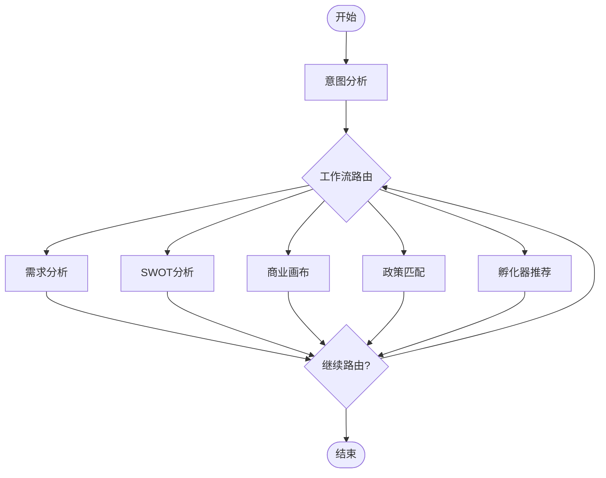

# LangGraph智能体工作流实现指南

## 🎯 概述

本文档描述了基于LangGraph的创业智能体工作流系统的完整实现，包括智能路由、状态管理和多智能体协作。

## 🏗️ 架构设计

### 核心组件

```
LangGraph工作流系统
├── ConversationState.py      # 对话状态管理
├── StartupWorkflow.py         # 主工作流类
├── nodes/
│   ├── AgentNodes.py         # 智能体节点
│   └── RouterNodes.py        # 路由节点
└── LangGraphController.py    # API控制器
```

### 工作流图



## 🔧 核心功能

### 1. 智能意图分析

```python
# 自动分析用户意图并推荐智能体
user_query = "我想开发一个AI教育平台"
# 输出: ["requirement_analysis", "swot_analysis", "business_canvas"]
```

### 2. 自动状态管理

```python
class ConversationState(TypedDict):
    messages: List[Dict[str, Any]]           # 消息历史
    project_context: Dict[str, Any]          # 项目上下文
    agent_results: Dict[str, Any]            # 智能体结果
    workflow_stage: str                      # 工作流阶段
    completed_agents: List[str]              # 已完成智能体
```

### 3. 智能体协作

- **依赖管理**: SWOT分析依赖需求分析结果
- **上下文传递**: 自动传递项目信息和前面的分析结果
- **结果共享**: 智能体间自动共享分析结果

### 4. 条件路由

```python
def workflow_condition(state: ConversationState) -> str:
    if not state["should_continue"]:
        return "END"
    
    next_agent = determine_next_agent(state)
    return next_agent or "workflow_router"
```

## 🚀 使用方式

### 1. 基本调用

```python
from com.startup.agents.workflow.StartupWorkflow import startup_workflow

# 执行工作流
async for event in startup_workflow.execute_workflow(
    user_query="我想创建一个在线教育平台",
    session_id="session_123",
    request_id="req_456"
):
    print(f"事件: {event['type']} - {event.get('content', '')}")
```

### 2. API调用

```bash
# 流式执行工作流
curl -X POST "http://localhost:8000/workflow/execute" \
  -H "Content-Type: application/json" \
  -d '{
    "query": "我想开发一个AI教育平台",
    "session_id": "session_123",
    "is_streaming": true
  }'
```

### 3. 状态查询

```bash
# 获取工作流状态
curl "http://localhost:8000/workflow/state/session_123/req_456"

# 获取执行历史
curl "http://localhost:8000/workflow/history/session_123/req_456"
```

## 📊 事件类型

### 工作流事件

| 事件类型 | 描述 | 示例 |
|---------|------|------|
| `start` | 智能体开始执行 | 开始需求分析... |
| `progress` | 执行进度更新 | 正在调用AI分析服务... |
| `stream` | 流式内容 | AI生成的实时内容 |
| `stream_complete` | 流式完成 | 需求分析完成 |
| `node_complete` | 节点完成 | requirement_analysis节点完成 |
| `workflow_complete` | 工作流完成 | 所有分析已完成 |
| `error` | 错误事件 | 执行失败信息 |

### 状态字段

```python
{
    "workflow_stage": "analyzing",           # 当前阶段
    "current_agent": "requirement_analysis", # 当前智能体
    "completed_agents": ["requirement_analysis"], # 已完成
    "agent_results": {                       # 智能体结果
        "requirement_analysis": {...}
    },
    "should_continue": true                  # 是否继续
}
```

## 🎯 智能路由策略

### 1. 意图识别

```python
# 关键词匹配示例
"SWOT分析" → ["requirement_analysis", "swot_analysis"]
"商业模式" → ["requirement_analysis", "business_canvas"]  
"政策补贴" → ["policy_matching"]
"孵化器" → ["incubator_recommendation"]
```

### 2. 依赖管理

```python
agent_dependencies = {
    "swot_analysis": ["requirement_analysis"],      # 需要需求分析结果
    "business_canvas": ["requirement_analysis"],    # 需要需求分析结果
    "policy_matching": [],                          # 可独立执行
    "incubator_recommendation": []                  # 可独立执行
}
```

### 3. 上下文构建

```python
def build_project_info_for_swot(state):
    info = []
    info.append(f"项目描述: {state['project_description']}")
    
    # 添加需求分析结果
    if "requirement_analysis" in state["agent_results"]:
        req_result = state["agent_results"]["requirement_analysis"]
        info.append(f"需求分析: {req_result['content'][:500]}...")
    
    return "\n".join(info)
```

## 🔍 调试和监控

### 1. 日志记录

```python
logger.info(f"[{request_id}] 执行需求分析节点")
logger.info(f"[{request_id}] 意图分析完成: {intent_result}")
```

### 2. 状态检查

```python
# 获取当前状态
state = await startup_workflow.get_workflow_state(session_id, request_id)
print(f"当前阶段: {state['workflow_stage']}")
print(f"已完成: {state['completed_agents']}")
```

### 3. 工作流可视化

```python
# 生成Mermaid图表
mermaid_graph = startup_workflow.visualize_workflow()
print(mermaid_graph)
```

## 🚨 错误处理

### 1. 智能体执行失败

```python
try:
    async for chunk in agent.execute_stream(parameters):
        # 处理流式输出
        pass
except Exception as e:
    # 记录错误并继续工作流
    state = add_agent_result(state, agent_name, {"error": str(e)})
    state = add_stream_event(state, "error", str(e), agent_name)
```

### 2. 工作流中断

```python
# 中断工作流
await startup_workflow.interrupt_workflow(session_id, request_id)
```

### 3. 状态恢复

```python
# LangGraph自动支持状态持久化和恢复
config = {"configurable": {"thread_id": session_id}}
state = await app.aget_state(config)
```

## 🔧 扩展指南

### 1. 添加新智能体

```python
# 1. 在AgentNodes中添加新节点
async def new_agent_node(self, state: ConversationState):
    # 实现新智能体逻辑
    pass

# 2. 在StartupWorkflow中注册节点
workflow.add_node("new_agent", self.agent_nodes.new_agent_node)

# 3. 添加路由条件
workflow.add_conditional_edges("new_agent", self.router_nodes.agent_condition)
```

### 2. 自定义路由逻辑

```python
def custom_router_condition(state: ConversationState) -> str:
    # 实现自定义路由逻辑
    if custom_condition(state):
        return "custom_agent"
    return "default_agent"
```

### 3. 添加新的状态字段

```python
class ConversationState(TypedDict):
    # 现有字段...
    custom_field: str           # 新增字段
    custom_data: Dict[str, Any] # 新增数据
```

## 📈 性能优化

### 1. 并行执行

```python
# 对于无依赖的智能体，可以并行执行
async def parallel_execution(state):
    tasks = []
    for agent in independent_agents:
        tasks.append(execute_agent(agent, state))
    
    results = await asyncio.gather(*tasks)
    return merge_results(results)
```

### 2. 缓存机制

```python
# 缓存智能体结果
@lru_cache(maxsize=100)
def cached_agent_execution(query_hash, agent_type):
    # 缓存相同查询的结果
    pass
```

### 3. 流式优化

```python
# 优化流式传输
async def optimized_stream(agent, parameters):
    buffer = []
    async for chunk in agent.execute_stream(parameters):
        buffer.append(chunk)
        
        # 批量发送以减少网络开销
        if len(buffer) >= BATCH_SIZE:
            yield batch_process(buffer)
            buffer.clear()
```

## 🎉 总结

LangGraph工作流系统提供了：

1. **智能路由**: 自动分析用户意图并推荐合适的智能体
2. **状态管理**: 自动管理对话状态和上下文传递
3. **智能体协作**: 支持依赖管理和结果共享
4. **流式处理**: 实时显示分析过程和结果
5. **可视化**: 工作流图表生成和状态监控
6. **错误处理**: 完善的错误处理和恢复机制

这个系统完美解决了之前的上下文传递问题，并为未来的智能体协作奠定了坚实基础！🚀