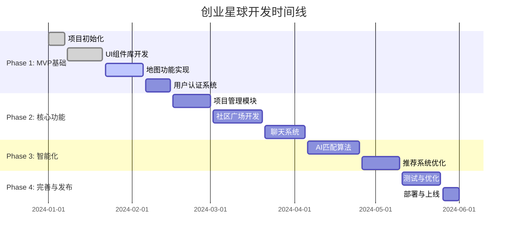

# 🗺️ 创业星球开发路线图

## 📋 总体规划

### 项目阶段划分

## 🎯 Phase 1: MVP基础功能 (2024.01 - 2024.02)

### 🏆 里程碑1.1: 项目框架搭建 ✅
**时间**: 2024.01.01 - 2024.01.07
**目标**: 完成项目基础架构

**完成项**:
- [x] React + TypeScript + Vite 项目初始化
- [x] 路由配置和页面结构
- [x] Supabase 集成配置
- [x] 基础工具配置 (ESLint, Prettier, Husky)
- [x] CI/CD 基础配置

### 🏆 里程碑1.2: UI组件库 ✅
**时间**: 2024.01.08 - 2024.01.21
**目标**: 建立统一的设计系统

**完成项**:
- [x] TailwindCSS 配置和主题定制
- [x] 基础UI组件 (Button, Input, Modal, Card)
- [x] 布局组件 (Header, Sidebar, Navigation)
- [x] 响应式设计适配
- [x] 组件文档和Storybook配置

### 🏆 里程碑1.3: 地图功能实现 🔄
**时间**: 2024.01.22 - 2024.02.05
**目标**: 核心地图展示功能

**开发中**:
- [x] 高德地图API集成
- [x] 地图基础显示和交互
- [ ] 项目标记点显示 (进行中)
- [ ] 地理编码和逆地理编码
- [ ] 周边搜索功能
- [ ] 地图筛选和分类

**技术要点**:
- 高德地图React组件封装
- 地理位置权限处理
- 地图性能优化
- 移动端适配

### 🏆 里程碑1.4: 用户认证系统 📅
**时间**: 2024.02.06 - 2024.02.15
**目标**: 完整的用户管理系统

**计划内容**:
- [ ] Supabase Auth集成
- [ ] 登录/注册页面
- [ ] 第三方登录 (微信、QQ、GitHub)
- [ ] 用户资料管理
- [ ] 权限和角色管理
- [ ] 密码重置功能

## 🚀 Phase 2: 核心功能开发 (2024.02 - 2024.04)

### 🏆 里程碑2.1: 项目管理模块
**时间**: 2024.02.16 - 2024.03.01
**目标**: 项目CRUD和展示功能

**功能列表**:
- [ ] 项目创建和编辑
- [ ] 项目详情页面
- [ ] 项目状态管理
- [ ] 团队成员管理
- [ ] 项目图片上传
- [ ] 项目搜索和筛选

### 🏆 里程碑2.2: 社区广场开发
**时间**: 2024.03.02 - 2024.03.20
**目标**: 统一的社区交互平台

**模块包含**:
- [ ] 创意市场
  - 创意发布和展示
  - 投票和评论系统
  - 队友招募功能
- [ ] 技能市场
  - 技能服务发布
  - 服务搜索和筛选
  - 评价和信用系统
- [ ] 功能需求
  - 需求提交和管理
  - 积分投票系统
  - 开发进度跟踪
- [ ] 积分商城
  - 积分获取机制
  - 商品兑换系统
  - 推广服务

### 🏆 里程碑2.3: 聊天系统
**时间**: 2024.03.21 - 2024.04.05
**目标**: 实时通信功能

**功能特性**:
- [ ] 一对一私信
- [ ] 群聊功能
- [ ] 消息历史
- [ ] 文件传输
- [ ] 在线状态
- [ ] 消息推送

## 🧠 Phase 3: 智能化功能 (2024.04 - 2024.05)

### 🏆 里程碑3.1: AI匹配算法
**时间**: 2024.04.06 - 2024.04.25
**目标**: 智能推荐系统

**算法组件**:
- [ ] 用户画像构建
- [ ] 相似度计算算法
- [ ] 协同过滤推荐
- [ ] 内容推荐引擎
- [ ] 地理位置权重
- [ ] 机器学习模型训练

### 🏆 里程碑3.2: 推荐系统优化
**时间**: 2024.04.26 - 2024.05.10
**目标**: 提升推荐准确性

**优化方向**:
- [ ] A/B测试框架
- [ ] 推荐效果分析
- [ ] 算法参数调优
- [ ] 实时推荐更新
- [ ] 用户反馈循环

## 🔧 Phase 4: 完善与发布 (2024.05 - 2024.06)

### 🏆 里程碑4.1: 测试与优化
**时间**: 2024.05.11 - 2024.05.25
**目标**: 确保产品质量

**测试内容**:
- [ ] 单元测试覆盖
- [ ] 集成测试
- [ ] E2E测试
- [ ] 性能测试
- [ ] 安全测试
- [ ] 用户体验测试

### 🏆 里程碑4.2: 部署与上线
**时间**: 2024.05.26 - 2024.06.01
**目标**: 产品正式发布

**部署任务**:
- [ ] 生产环境配置
- [ ] 域名和SSL证书
- [ ] CDN配置
- [ ] 监控和日志
- [ ] 备份策略
- [ ] 上线预演

## 📊 风险评估与应对

### 高风险项
| 风险项 | 影响程度 | 概率 | 应对措施 |
|--------|----------|------|----------|
| 高德地图API限制 | 高 | 中 | 备选方案: 百度地图 |
| AI算法复杂度超出预期 | 中 | 高 | 简化初版算法，分阶段优化 |
| 用户获取困难 | 高 | 中 | 早期内测，口碑传播 |
| 技术债务积累 | 中 | 中 | 定期重构，代码审查 |

### 缓解策略
- **技术风险**: 保持技术选型的灵活性，准备备选方案
- **时间风险**: 采用敏捷开发，定期调整计划
- **质量风险**: 建立完善的测试体系和代码规范
- **资源风险**: 合理分配开发任务，避免单点依赖

## 🎯 成功指标

### MVP阶段指标
- [ ] 用户注册数 > 100
- [ ] 项目发布数 > 50
- [ ] 用户留存率 > 30%
- [ ] 页面加载速度 < 3s

### 正式版指标
- [ ] 月活用户 > 1000
- [ ] 成功匹配数 > 50
- [ ] 用户满意度 > 4.0/5.0
- [ ] 社区内容数 > 500

## 📝 定期评审

### 周评审 (每周五)
- 进度检查和问题识别
- 下周计划调整
- 技术难点讨论

### 月评审 (每月最后一周)
- 里程碑达成情况
- 路线图调整
- 团队反思和改进

### 季度评审 (每季度末)
- 整体战略回顾
- 市场反馈分析
- 长期规划调整

---

**最后更新**: 2024-01-22
**负责人**: 项目负责人
**下次更新**: 2024-02-01 