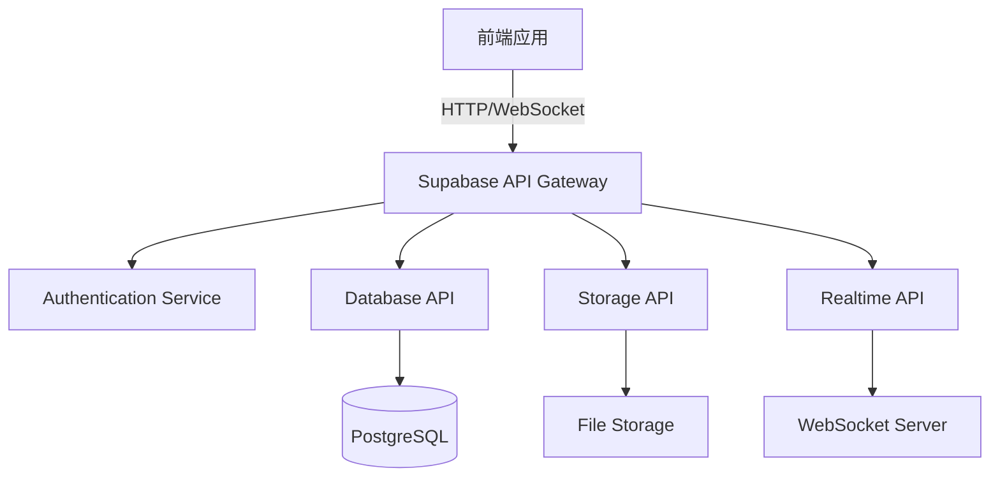

# 📡 API文档

## 📋 API概览

创业星球后端API基于Supabase构建，提供RESTful和实时API服务。所有API都支持JSON格式的数据交换，并且需要适当的身份验证。

### 🏗️ 架构概述



### 🔑 认证方式

所有API请求都需要包含认证信息：

```http
Authorization: Bearer <jwt_token>
apikey: <supabase_anon_key>
```

### 📊 API状态

| 服务模块 | 状态 | 版本 | 文档状态 |
|---------|------|------|----------|
| 用户认证 | ✅ 稳定 | v1.0 | 📚 完整 |
| 用户管理 | ✅ 稳定 | v1.0 | 📚 完整 |
| 项目管理 | 🔄 开发中 | v0.8 | 📝 进行中 |
| 社区功能 | 📅 计划中 | v0.1 | 📋 规划中 |
| 聊天系统 | 📅 计划中 | v0.1 | 📋 规划中 |
| 地图服务 | 🔄 开发中 | v0.5 | 📝 进行中 |

## 📚 API模块文档

### 🔐 [认证API](./authentication.md)
- 用户注册和登录
- 令牌管理和刷新
- 第三方OAuth集成
- 密码重置功能

### 👤 [用户API](./users-api.md)
- 用户信息管理
- 个人资料CRUD
- 技能标签管理
- 用户偏好设置

### 📱 [项目API](./projects-api.md)
- 项目创建和管理
- 项目搜索和筛选
- 团队成员管理
- 项目状态跟踪

### 🏛️ [社区API](./community-api.md)
- 创意市场功能
- 大师工坊服务
- 功能需求管理
- 积分和投票系统

### 💬 [聊天API](./chat-api.md)
- 实时消息传递
- 聊天室管理
- 文件传输
- 在线状态

### 🗺️ [地图API](./map-api.md)
- 地理位置服务
- 项目地图展示
- 位置搜索功能
- 地理围栏服务

## 🚀 快速开始

### 1. 获取API密钥

```bash
# 环境变量配置
SUPABASE_URL=https://your-project.supabase.co
SUPABASE_ANON_KEY=your-anon-key
SUPABASE_SERVICE_ROLE_KEY=your-service-role-key
```

### 2. 初始化客户端

```typescript
import { createClient } from '@supabase/supabase-js';

const supabase = createClient(
  process.env.SUPABASE_URL,
  process.env.SUPABASE_ANON_KEY
);
```

### 3. 基础API调用示例

```typescript
// 用户注册
const { data, error } = await supabase.auth.signUp({
  email: 'user@example.com',
  password: 'password123'
});

// 获取用户项目列表
const { data: projects } = await supabase
  .from('projects')
  .select('*')
  .eq('creator_id', user.id);

// 实时订阅
const subscription = supabase
  .channel('projects')
  .on('postgres_changes', 
    { event: '*', schema: 'public', table: 'projects' },
    payload => console.log('项目更新:', payload)
  )
  .subscribe();
```

## 🔧 开发工具

### API测试工具
- **Postman集合**: [下载Postman配置](./postman-collection.json)
- **Insomnia工作区**: [导入Insomnia配置](./insomnia-workspace.json)
- **cURL示例**: 每个API都提供了cURL命令示例

### SDK和客户端库
```typescript
// JavaScript/TypeScript
import { createClient } from '@supabase/supabase-js';

// React Hook
import { useSupabaseClient } from '@supabase/auth-helpers-react';

// Node.js服务端
import { createClient } from '@supabase/supabase-js';
```

## 📏 API规范

### 请求格式
```http
POST /rest/v1/projects HTTP/1.1
Host: your-project.supabase.co
Authorization: Bearer <jwt_token>
apikey: <supabase_anon_key>
Content-Type: application/json
Prefer: return=representation

{
  "title": "项目标题",
  "description": "项目描述",
  "category": "技术"
}
```

### 响应格式
```json
{
  "id": "uuid",
  "title": "项目标题",
  "description": "项目描述",
  "category": "技术",
  "creator_id": "uuid",
  "created_at": "2024-01-26T10:00:00Z",
  "updated_at": "2024-01-26T10:00:00Z"
}
```

### 错误格式
```json
{
  "error": {
    "code": "INVALID_REQUEST",
    "message": "请求参数无效",
    "details": "title字段不能为空"
  }
}
```

## 📊 API限制和配额

### 请求限制
| 端点类型 | 限制 | 时间窗口 |
|---------|------|----------|
| 认证相关 | 30次/分钟 | 1分钟 |
| 数据查询 | 1000次/分钟 | 1分钟 |
| 数据写入 | 100次/分钟 | 1分钟 |
| 实时连接 | 50个/用户 | 同时 |

### 数据限制
- **请求体大小**: 最大2MB
- **文件上传**: 单文件最大50MB
- **查询结果**: 单次最多1000条记录
- **实时订阅**: 每个连接最多10个频道

## 🔍 错误代码参考

### HTTP状态码
| 状态码 | 含义 | 说明 |
|--------|------|------|
| 200 | OK | 请求成功 |
| 201 | Created | 资源创建成功 |
| 400 | Bad Request | 请求格式错误 |
| 401 | Unauthorized | 未授权 |
| 403 | Forbidden | 无权限 |
| 404 | Not Found | 资源不存在 |
| 409 | Conflict | 资源冲突 |
| 429 | Too Many Requests | 请求过于频繁 |
| 500 | Internal Server Error | 服务器错误 |

### 业务错误码
| 错误码 | 说明 | 解决方案 |
|--------|------|----------|
| USER_NOT_FOUND | 用户不存在 | 检查用户ID |
| PROJECT_LIMIT_EXCEEDED | 项目数量超限 | 升级账户或删除旧项目 |
| INVALID_COORDINATES | 地理坐标无效 | 检查经纬度格式 |
| SKILL_ALREADY_EXISTS | 技能已存在 | 使用现有技能或修改名称 |

## 🧪 测试环境

### 测试服务器
- **Base URL**: `https://test-project.supabase.co`
- **API Key**: `test-api-key`
- **数据库**: 测试数据会定期重置

### 测试账户
```json
{
  "email": "test@example.com",
  "password": "test123456",
  "role": "developer"
}
```

## 📈 API变更日志

### v1.0.0 (2024-02-01) - 计划中
- ✨ 社区API正式发布
- ✨ 聊天API beta版本
- 🔧 认证API性能优化
- 📚 完整API文档上线

### v0.8.0 (2024-01-26) - 当前版本
- ✨ 项目API beta版本
- 🔧 用户API功能完善
- 🐛 修复地理位置搜索bug
- 📝 API文档初版

### v0.5.0 (2024-01-15)
- ✨ 用户认证API发布
- ✨ 基础用户管理API
- 🔧 数据库结构优化

## 💡 最佳实践

### 1. 认证管理
```typescript
// 使用token自动刷新
const supabase = createClient(url, key, {
  auth: {
    autoRefreshToken: true,
    persistSession: true
  }
});
```

### 2. 错误处理
```typescript
const { data, error } = await supabase
  .from('projects')
  .select('*');

if (error) {
  console.error('API错误:', error.message);
  // 根据错误类型进行不同处理
  switch (error.code) {
    case 'PGRST116':
      // 权限错误处理
      break;
    default:
      // 通用错误处理
  }
}
```

### 3. 性能优化
```typescript
// 使用选择器减少数据传输
const { data } = await supabase
  .from('projects')
  .select('id, title, creator:profiles(username)')
  .limit(20);

// 使用索引字段进行查询
const { data } = await supabase
  .from('projects')
  .select('*')
  .eq('creator_id', userId) // creator_id有索引
  .order('created_at', { ascending: false });
```

## 📞 支持和反馈

- **技术支持**: api-support@startupplanet.com
- **Bug报告**: [GitHub Issues](https://github.com/startup-planet/issues)
- **功能建议**: [功能需求页面](../community/features)
- **API状态**: [状态页面](https://status.startupplanet.com)

---

**📚 文档版本**: v0.8.0
**🔄 最后更新**: 2024-01-26
**�� 下次更新**: 2024-02-01 