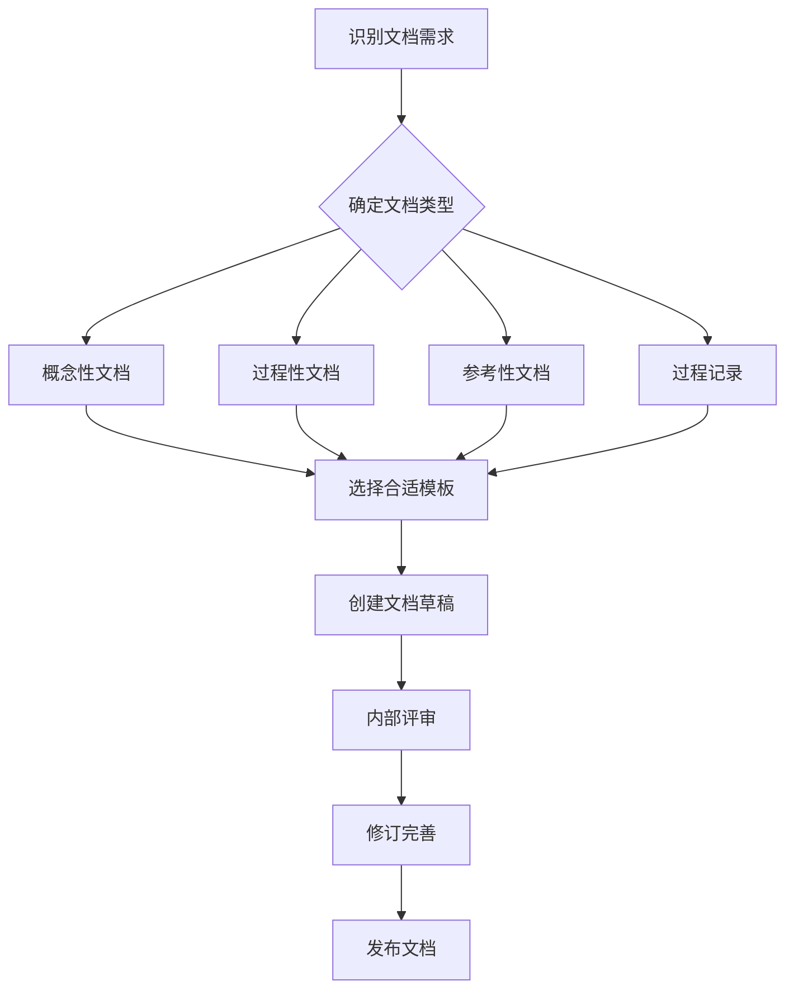
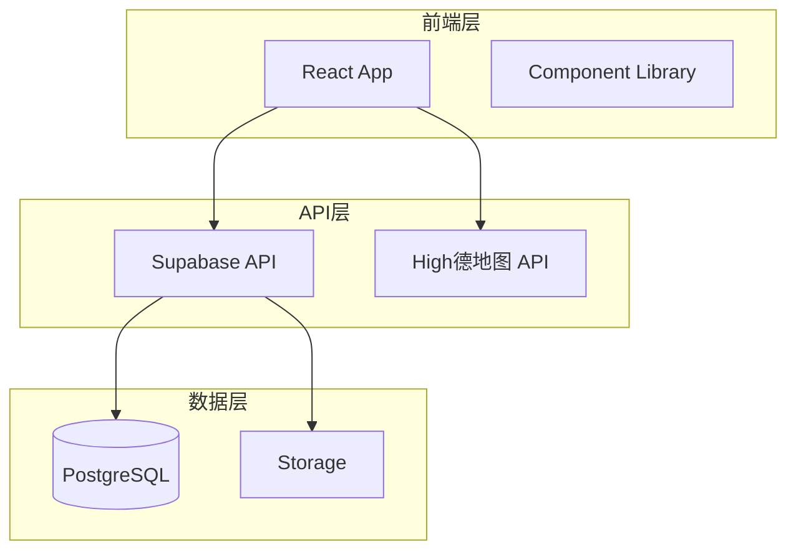

# 📚 创业星球项目文档中心

欢迎来到创业星球项目的文档中心！这里包含了项目的完整文档体系，采用层次化、模块化的方式组织，旨在为开发者、贡献者和用户提供全面的项目信息。

## 🗂️ 文档架构概览

```
docs/
├── 📁 01-project-overview/     # 项目概览 - 了解项目愿景和目标
├── 📁 02-planning/             # 项目规划 - 路线图和里程碑
├── 📁 03-architecture/         # 系统架构 - 技术设计和结构
├── 📁 04-development/          # 开发指南 - 如何参与开发
├── 📁 05-api/                  # API文档 - 接口规范和示例
├── 📁 06-ui-ux/                # 设计文档 - UI/UX设计规范
├── 📁 07-progress/             # 进度跟踪 - 开发进展和日志
├── 📁 08-deployment/           # 部署运维 - 环境配置和部署
├── 📁 09-user-guide/           # 用户指南 - 功能使用说明
└── 📁 10-resources/            # 资源文件 - 词汇表和参考资料
```

## 🎯 文档使用指南

### 👋 新手入门路径
如果您是项目新手，建议按以下顺序阅读：

1. **[项目概览](./01-project-overview/README.md)** - 了解项目背景和价值
2. **[快速开始](../README.md#快速开始)** - 搭建开发环境
3. **[开发指南](./04-development/README.md)** - 学习开发规范
4. **[贡献指南](../CONTRIBUTING.md)** - 了解如何参与项目

### 👨‍💻 开发者路径
开发者关注的核心文档：

1. **[系统架构](./03-architecture/README.md)** - 理解技术架构
2. **[API文档](./05-api/README.md)** - 掌握接口规范
3. **[开发指南](./04-development/README.md)** - 遵循开发规范
4. **[进度跟踪](./07-progress/README.md)** - 了解开发进展

### 🎨 设计师路径
设计相关文档：

1. **[UI/UX设计](./06-ui-ux/README.md)** - 设计系统和规范
2. **[用户指南](./09-user-guide/README.md)** - 用户体验流程
3. **[项目概览](./01-project-overview/README.md)** - 产品定位和目标

### 🚀 运维路径
部署和运维相关：

1. **[部署指南](./08-deployment/README.md)** - 环境配置和部署
2. **[系统架构](./03-architecture/README.md)** - 基础设施设计
3. **[API文档](./05-api/README.md)** - 服务接口规范

## 📋 文档分类说明

### 📊 按内容类型分类

#### 📖 概念性文档 (Conceptual)
**目的**: 解释"为什么"和"是什么"
- 项目愿景和目标
- 系统架构设计
- 产品功能概述

**特点**:
- 高层次抽象
- 面向理解和决策
- 相对稳定，变更较少

#### 📝 过程性文档 (Procedural)  
**目的**: 说明"怎么做"
- 开发环境搭建
- 部署操作步骤
- 测试执行流程

**特点**:
- 步骤化指导
- 面向执行操作
- 需要定期验证更新

#### 📚 参考性文档 (Reference)
**目的**: 提供"查找信息"
- API接口文档
- 配置参数说明
- 错误代码对照

**特点**:
- 详细完整
- 便于快速查找
- 与代码同步更新

#### 📈 过程记录 (Process Records)
**目的**: 记录"发生了什么"
- 开发进度日志
- 会议记录
- 变更历史

**特点**:
- 时间序列记录
- 历史追溯价值
- 持续增量更新

### 🎯 按受众分类

| 受众类型 | 主要关注文档 | 阅读频率 | 更新需求 |
|---------|-------------|----------|----------|
| **新开发者** | 项目概览、开发指南 | 首次+偶尔 | 保持准确性 |
| **核心开发者** | 架构设计、API文档 | 经常 | 与代码同步 |
| **产品经理** | 项目规划、进度跟踪 | 定期 | 实时更新 |
| **设计师** | UI/UX文档、用户指南 | 定期 | 设计迭代更新 |
| **运维工程师** | 部署文档、架构文档 | 按需 | 环境变更更新 |
| **最终用户** | 用户指南、FAQ | 按需 | 功能发布更新 |

## 🔄 文档维护流程

### 📝 文档创建流程

#### 1. 确定文档需求


#### 2. 文档创建检查清单
- [ ] 确定目标受众和使用场景
- [ ] 选择合适的文档模板
- [ ] 编写清晰的标题和摘要
- [ ] 提供必要的示例和图表
- [ ] 添加相关文档的交叉引用
- [ ] 进行拼写和语法检查
- [ ] 安排同行评审

### 🔄 文档更新流程

#### 更新触发条件
1. **代码变更** - API、功能、架构变更
2. **流程调整** - 开发、部署流程优化
3. **反馈驱动** - 用户反馈、使用问题
4. **定期审查** - 定期检查文档准确性

#### 更新优先级
| 优先级 | 条件 | 响应时间 | 负责人 |
|--------|------|----------|--------|
| 🔴 紧急 | 严重错误、安全问题 | 24小时 | 相关负责人 |
| 🟡 高 | API变更、新功能发布 | 1周 | 功能负责人 |
| 🟢 中 | 流程优化、内容补充 | 2周 | 文档维护者 |
| ⚪ 低 | 格式调整、小幅优化 | 1月 | 任何贡献者 |

### 📊 文档质量控制

#### 质量标准
1. **准确性** - 内容与实际情况一致
2. **完整性** - 覆盖所需信息点
3. **清晰性** - 语言简洁易懂
4. **时效性** - 信息及时更新
5. **一致性** - 风格和术语统一

#### 评审检查点
```markdown
## 文档评审清单

### 内容质量
- [ ] 信息准确无误
- [ ] 逻辑结构清晰
- [ ] 示例代码可运行
- [ ] 图表清晰有效

### 用户体验
- [ ] 目标受众明确
- [ ] 使用场景清楚
- [ ] 操作步骤完整
- [ ] 问题解答充分

### 技术规范
- [ ] 符合文档规范
- [ ] 链接有效可访问
- [ ] 格式排版正确
- [ ] 术语使用一致
```

## 🛠️ 文档工具和规范

### 📝 写作工具
- **Markdown编辑器**: VSCode + Markdown插件
- **图表工具**: Mermaid (流程图)、Draw.io (架构图)
- **截图工具**: Snipaste、LightShot
- **协作平台**: GitHub、语雀（团队协作）

### 📐 格式规范

#### Markdown规范
```markdown
# 一级标题 (页面标题)
## 二级标题 (主要章节)
### 三级标题 (小节)
#### 四级标题 (细节)

- 使用无序列表表示并列项
1. 使用有序列表表示步骤
- [ ] 使用任务列表表示待办事项

> 使用引用块突出重要信息

`code` 内联代码格式

```语言
代码块格式
```

| 表格 | 格式 | 示例 |
|------|------|------|
| 左对齐 | 居中 | 右对齐 |
```

#### 命名规范
- **文件命名**: 使用小写字母和连字符，如 `setup-guide.md`
- **图片命名**: 描述性名称，如 `architecture-overview.png`
- **链接锚点**: 使用连字符分隔，如 `#quick-start-guide`

### 🖼️ 图表标准

#### 架构图规范


#### 流程图规范
- 使用标准的流程图符号
- 保持统一的颜色主题
- 添加必要的说明文字
- 控制图表复杂度

## 📈 文档指标和分析

### 📊 关键指标
1. **覆盖度** - 功能点文档覆盖率
2. **时效性** - 文档更新滞后时间
3. **使用率** - 文档访问和使用频率
4. **满意度** - 用户反馈和评分

### 📝 定期评审

#### 月度评审
- **内容审查**: 检查文档准确性和完整性
- **使用分析**: 统计文档访问和反馈数据
- **更新计划**: 制定下月文档更新计划

#### 季度评审
- **结构优化**: 评估文档架构合理性
- **工具升级**: 更新文档工具和流程
- **培训规划**: 组织文档写作培训

## 🤝 贡献文档

### 如何贡献
1. **发现问题** - 通过Issue报告文档问题
2. **建议改进** - 提出文档优化建议
3. **直接编辑** - 通过PR提交文档修改
4. **创建新文档** - 按模板创建新的文档

### 贡献指南
详细的文档贡献流程请参考 [贡献指南](../CONTRIBUTING.md#文档贡献)

## 📞 获取帮助

### 文档相关问题
- **内容错误**: 通过GitHub Issue报告
- **使用问题**: 在Discussions中提问
- **改进建议**: 发送邮件至 docs@startupplanet.com

### 快速联系
- **文档维护者**: docs-maintainer@startupplanet.com
- **技术写作**: technical-writer@startupplanet.com

## 📚 扩展资源

### 写作参考
- [中文技术文档写作规范](https://github.com/ruanyf/document-style-guide)
- [Markdown语法指南](https://www.markdownguide.org/)
- [Mermaid图表语法](https://mermaid-js.github.io/mermaid/)

### 工具推荐
- [Grammarly](https://grammarly.com/) - 英文语法检查
- [秘塔写作猫](https://xiezuocat.com/) - 中文写作辅助
- [Carbon](https://carbon.now.sh/) - 代码截图美化

---

## 📋 文档状态

| 文档模块 | 完成度 | 最后更新 | 维护者 |
|---------|--------|----------|--------|
| 项目概览 | 80% | 2024-01-26 | @project-lead |
| 项目规划 | 90% | 2024-01-26 | @project-lead |
| 系统架构 | 70% | 2024-01-20 | @tech-lead |
| 开发指南 | 85% | 2024-01-25 | @dev-team |
| API文档 | 60% | 2024-01-26 | @api-team |
| UI/UX文档 | 40% | 2024-01-15 | @design-team |
| 进度跟踪 | 95% | 2024-01-26 | @project-lead |
| 部署文档 | 30% | 2024-01-10 | @devops-team |
| 用户指南 | 20% | 2024-01-05 | @product-team |
| 资源文件 | 50% | 2024-01-20 | @doc-team |

**总体完成度**: 62%  
**最后全面更新**: 2024-01-26  
**下次计划评审**: 2024-02-15

---

📝 **文档反馈**: 如果您在使用文档过程中遇到任何问题或有改进建议，请随时通过 [GitHub Issues](https://github.com/startup-planet/startup-planet/issues) 或邮件联系我们。您的反馈是我们改进文档质量的重要依据！ 